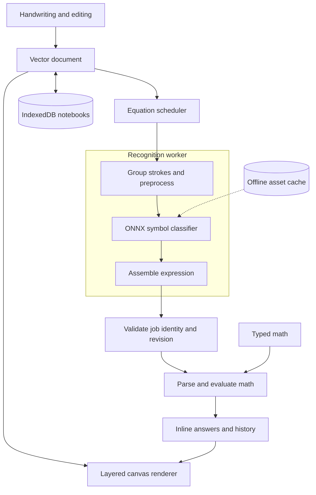

<div align="center">

# CalcInk

**Handwritten math. Answers beside your ink.**

An on-device math notebook with live calculations, editable ink, and offline support.

[Features](#features) · [Quick start](#quick-start) · [Architecture](#architecture) · [Documentation](#documentation)

</div>

---

## Features

|                         | What you can do                                                                                               |
| :---------------------- | :------------------------------------------------------------------------------------------------------------ |
| **Write and calculate** | Draw arithmetic ending in `=`; answers update when equations change                                           |
| **Draw naturally**      | Use mouse, touch, or stylus with pen, pencil, highlighter, colour, width, and optional pressure               |
| **Edit your page**      | Undo/redo, clear, whole-stroke and partial erasers; select, move, resize, duplicate, or delete with the lasso |
| **Add annotations**     | Insert text, shapes, arrows, and dashed regions                                                               |
| **Use typed math**      | Calculate typed arithmetic expressions                                                                        |
| **Organize notebooks**  | Name and switch notebooks, import/export JSON, change themes and paper patterns                               |
| **Navigate freely**     | Pan and zoom ink, annotations, and answers together                                                           |
| **Keep data local**     | Save notebooks on your device; recognition and calculation run entirely in the browser                        |
| **Work offline**        | Reload the production app offline after its assets and model are cached                                       |

## Quick start

**Requirements:** Node.js **22.18+**, npm, and a current Chromium browser supporting workers, WASM, and worker OffscreenCanvas.

```bash
git clone https://github.com/Shaashwatprasad/CalcInk.git
cd CalcInk
npm ci
npm run dev
```

Open the local URL printed by Vite. The pretrained model is included; no Python installation or separate model download is required.

### Production

```bash
npm run build
npm run preview
```

Serve over **localhost or HTTPS**. Wait for **Offline ready** before disconnecting and reloading. Offline caching is enabled in production builds.

### Checks

```bash
npm run typecheck
npm run lint
npm run format:check
npm test
npm run build
```

Browser test setup and measurement procedures are in [Validation](docs/VALIDATION.md). Repository layout and benchmark commands are described in [the layout decision](docs/decisions/008-repository-layout.md) and [measurement guide](scripts/benchmark/README.md).

## Architecture



Vector ink is the source of truth; answers are derived. Recognition runs in a worker, drawing uses animation frames outside React, and job identities reject stale replies after edits. Math is parsed safely without `eval()`.

| Layer             | Technology                                                  |
| :---------------- | :---------------------------------------------------------- |
| Interface         | React 19 · TypeScript · Vite                                |
| Drawing           | Canvas2D · requestAnimationFrame                            |
| Recognition       | ONNX Runtime Web 1.22.0 · single-threaded WASM · Web Worker |
| Calculation       | Custom TypeScript parser and evaluator                      |
| Storage / offline | IndexedDB · versioned Service Worker cache                  |

## Recognition & math

- **Model:** Rafi Ibn Sultan’s Dataset II CNN, converted to FP32 ONNX. Provenance, preprocessing, and artifact checks are in the [model audit](docs/MODEL-AUDIT.md).
- **Recognized symbols:** `0–9`, `+`, `−`, `×`, `÷`, `.`, and `=`. Write separated symbols of similar size.
- **Math:** decimals, negative numbers, normal precedence, and left associativity. Typed math also supports parentheses.
- **Errors:** incomplete, malformed, or uncertain expressions withhold their answer; division by zero displays **Cannot divide by zero**.
- **Limits:** handwritten parentheses, touching glyphs, and nested handwritten fractions remain unsupported or unreliable. No writer-diverse accuracy claim is made. Numbers use JavaScript floating point, displayed to twelve significant digits.

## Documentation

[Architecture](docs/ARCHITECTURE.md) · [Model audit](docs/MODEL-AUDIT.md) · [Validation](docs/VALIDATION.md) · [Progress](docs/PROGRESS.md)

## License

[Apache-2.0](LICENSE). Model: [MIT](public/models/LICENSE). Runtime and font attribution: [Third-party notices](THIRD_PARTY_LICENSES.md).
