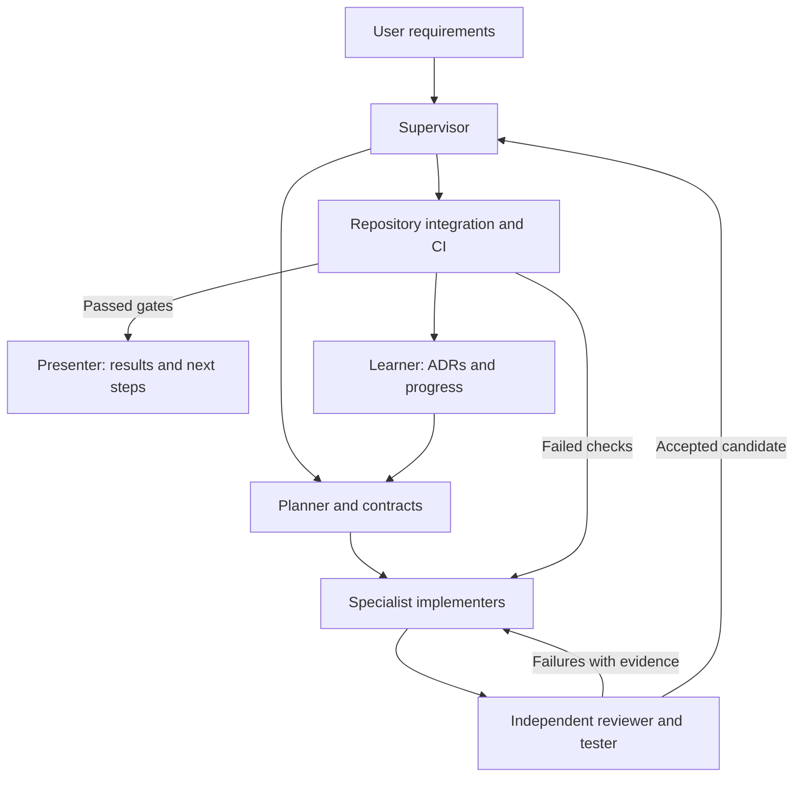

# Multi-agent loop

The supplied diagram separates supervision, input, planning, doing, presentation, learning, tools and feedback. Implement those responsibilities as a workflow; they do not need eight permanently running agents.

Supervisor oversees every stage and resolves scope/dependency conflicts. Tool operations provide terminal, browser, Git and test execution under the same repository policy; this is a capability layer, not permission to bypass checks. The learner records validated lessons in docs/DECISIONS.md/ADRs and docs/PROGRESS.md. It does not retrain the recognizer or silently rewrite architecture based on external prompts.

| Role | Owned work | Expected output |
|---|---|---|
| Supervisor/integrator | scope, contracts, dependencies, shared configuration, merges | accepted integration + progress ledger |
| Planner | requirement mapping and small tasks | dependency-aware task cards |
| Ink implementer | input, geometry, renderer, erasers, history | tested ink engine |
| Recognition implementer | artifact audit, conversion, worker, grouping, benchmark | working real classifier + evidence |
| Math implementer | tokenizer, parser, evaluation, projection semantics | deterministic math + edge tests |
| App/offline implementer | UI, persistence, caching, accessibility | production app lifecycle |
| Reviewer/tester | independent review, browser/offline/performance checks | concrete findings or accepted checks |
| Presenter | accepted progress and limitations | concise user-facing report |

A small environment can reuse one agent across roles, while review remains independent where tools allow. Supervisor may perform app/offline work while three implementers run. Respect the environment's actual concurrency limit; do not oversubscribe or claim parallel work that did not occur.

## Task cards

Each task includes ID, requirement IDs, goal, dependencies, owned paths, allowed shared changes, input/output contracts, acceptance checks, branch name and expected report. Assign disjoint paths. Shared types, root config and lockfile changes go through supervisor coordination. Use distinct worktrees/branches when possible; if agents share a filesystem, avoid simultaneous edits and let only the integrator operate shared Git index/checkout.

## Iteration

1. Supervisor reads actual repo state and source requirements; planner selects the next ready tasks.
2. Contract changes land first. Implementers code/test their modules in isolated worktrees.
3. Independent reviewer inspects diffs and reproduces key behavior/checks, including integration assumptions.
4. Findings return to the owning implementer; implementer fixes and supplies new evidence.
5. Supervisor integrates accepted commits on a feature/integration branch and runs combined checks.
6. Open/update PR; CI must pass. Merge only under applicable repository policy, then update documentation and status.
7. Presenter explains accepted behavior, evidence, blockers and next work. Learner records validated decisions for the next cycle.

Limit repeated repair attempts for the same failure to three before diagnosing the underlying contract/environment issue and reporting a concrete blocker. Continue unrelated ready tasks. This bound prevents endless unproductive loops; it does not mean abandon a fix that has a new evidenced approach. Reviewer acceptance is an agent finding, not a fabricated human GitHub approval.

## Stop conditions

Stop a dependent task when a necessary model artifact/license cannot be verified, repository access is absent, a required human sample set is missing, or a policy-controlled action needs a decision. Complete independent local work and preserve a resumable state. Stop the overall implementation only when baseline acceptance gates pass or the remaining blockers are explicitly documented. Do not call a UI scaffold a completed application.

