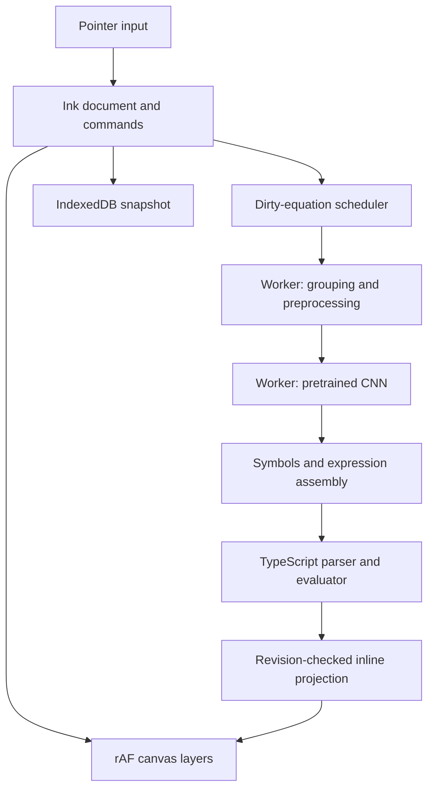

# Finalized architecture

## Modules and responsibilities

| Module | Responsibility |
|---|---|
| App/UI | tools, status, accessible controls, notebook appearance |
| Input controller | pointer capture, coalesced samples, CSS document coordinates |
| Ink document | strokes, erase masks, transactions, revisions, commands |
| Renderer | committed ink + active stroke + projection layers, rAF scheduling |
| Spatial index | bounds queries for rendering/erasure/affected equations |
| Scheduler | dirty equation jobs, debounce/coalescing, queue bounds |
| Recognition worker | grouping, rasterization, preprocessing, model, top-k |
| Expression assembler | reading order, multi-digit/decimal grouping, terminal equals |
| Math engine | tokenizer, parser, finite numeric evaluation, typed failures |
| Projection store | revision-keyed answers/status; no authoritative ink mutation |
| Persistence/offline | IndexedDB document recovery + service-worker asset cache |
| Metrics | timings, frame distribution, queue/history/cache counters |

## Ink and render loop

Store samples in document/CSS units with stable IDs, point time and optional pressure; canvas backing pixels use DPR. Cache viewport transforms, refreshing them for resize, scrolling or layout changes. Pointer capture survives leaving the canvas. Only one drawing pointer controls a stroke; reject accidental secondary touches. Use touch-action appropriately.

Pointer handlers enqueue samples and schedule at most one requestAnimationFrame. Frame processing draws newly queued segments on the active layer. Do not repeatedly redraw all committed ink on pointermove, read canvas pixels, serialize the notebook or trigger React state updates per sample.

At pen-up, preserve queued samples, finalize smoothing/endpoints and single-point dots, commit a transaction, then schedule recognition from the document event. The pasted skeleton is explanatory only: clearing its tail in end() before queued points render loses geometry. A rebuild must not discard active ink. Use one shared stroke geometry implementation for incremental drawing, full replay and recognition rasterization; test their equivalence.

Undo, erase, clear and resize invalidate committed pixels. Collapse repeated invalidations into one frame. Begin with correct full replay; introduce dirty rectangles/spatial indexing where measured cost requires it. Dirty rectangles include pen width/anti-alias margins and all intersecting strokes, clipped during repaint. Avoid translucent highlighter double-blending; highlighter is optional.

Three transparent canvases: committed ink, active stroke, computed projection/UI. Background paper is CSS. Resize changes backing stores, resets transforms and replays the document. OffscreenCanvas may be used in the worker for symbol rasterization. If unavailable, implement worker-side rasterization or a separately validated fallback; do not silently move expensive preprocessing onto the drawing path.

## Erasure and history

Whole-stroke erasure deletes hit strokes using segment-distance testing, not just bounding boxes. Pixel erasure removes only intersecting regions: persist erase paths/masks against the stroke IDs existing in that transaction, or implement a tested geometric split. destination-out pixels alone are insufficient. New ink drawn later must not inherit old erase masks. Save bounds and erase semantics in document state; apply identical masks during redraw and recognition.

One user stroke or eraser gesture creates one history transaction. Undo/redo restores geometry and masks, emits affected bounds/revisions and invalidates projections. Clear is undoable unless a documented product policy says otherwise. Bound history by a documented configurable limit; history need not survive reload, but current ink and masks must. Do not prune data needed to reconstruct visible ink.

## Recognition and segmentation

Recognize after a short quiet period/pen-up; merge unfinished jobs by equation revision and keep at most one model run active. Continue ink immediately while the worker loads/warms once. READY means the session is actually runnable.

Group nearby strokes into symbols and lines. Do not equate one stroke or one connected component with one character: +, ×, = and ÷ use multiple strokes/components. Conversely, adjacent digits may touch. Handle decimal dots relative to baseline/neighbor scale; independent tight-square scaling can turn a dot into a large blob. Preserve baseline and geometric metadata and investigate alternative grouping hypotheses when confidence is low.

Order symbols spatially and join multi-digit numbers/decimals using calibrated gaps. Only a confidently recognized terminal equals triggers evaluation. Changes to grouping can split/merge equations: retire previous equation identities and results, not merely add new ones. Erasing equals removes the answer. Mark edited results dirty immediately, then recompute. Low confidence yields a subtle uncertain status, not a confident invented answer.

Return top-k labels plus geometry. Limited syntax/geometry reranking is allowed, but must not force every scribble into a valid expression. Softmax scores are not automatically calibrated certainty. Do not invent missing symbols. Cache by geometry, erase state, preprocessing version and model hash; bound cache size.

## Math and display

Implement a small TypeScript recursive-descent or Pratt parser. Unary signs bind more tightly than multiplication/division; these bind more tightly than addition/subtraction. Subtraction/division associate left. Normalize recognized glyphs to canonical operator tokens. Equals is a terminal delimiter, not an executable equality operator.

No eval/new Function. Bound input/token lengths. Return valid, incomplete, invalid or undefined outcomes; detect zero divisors and nonfinite results. Use JavaScript numbers with a documented display-precision policy; avoid presenting floating-point artifacts such as 0.30000000000000004. Do not claim exact decimal arithmetic unless implemented. Anchor results just after equals in document coordinates and manage edge clipping without moving source strokes. Answers are derived state, outside ink undo history.

## Reliability, persistence and offline

Recognizer: uninitialized → loading → ready ↔ recognizing; loading/run failures enter error/recovery with drawing still functional. Equation: dirty → recognizing → recognized → valid/invalid/incomplete/uncertain/undefined. Use discriminated unions rather than conflicting booleans.

Persist a debounced versioned document snapshot to IndexedDB. Serialize writes so slow older snapshots cannot overwrite newer edits. Recover only validated data; expose export/recovery if storage fails. Add migration boundaries from v1 onward. Do not silently claim a failed save succeeded.

Cache shell, bundles, workers, model, labels/manifest, runtime JS/WASM, fonts and icons from the same origin. Match ORT JS/WASM build versions. Show Offline ready only after critical cache completion, not merely service-worker registration. Keep cache updates atomic and avoid mixing app/model versions or deleting assets still used by open tabs. Service workers require a secure context or localhost. IndexedDB document persistence and offline asset caching are separate systems.

Detect essential Canvas/Pointer Events/Worker/WASM capabilities. IndexedDB loss disables persistence, not drawing; model failure disables recognition, not ink; worker restart is bounded and replays current jobs. Begin with single-threaded WASM for a portable baseline; additional WASM threads need verified cross-origin isolation and hosting headers. WebGPU session creation/run failures must recover through a usable WASM session, not just an availability boolean.

## Suggested source layout

src/app, src/ink, src/document, src/render, src/recognition, src/workers, src/math, src/projection, src/persistence, src/offline, src/shared, src/metrics; public/models and public/runtime; scripts/model; tests/unit, tests/integration, tests/e2e; benchmark and benchmark-data; docs/decisions. Keep shared contracts framework-independent. The integrator owns root configuration/lockfiles.

Create ADRs for Canvas2D, vector source of truth, three layers, worker boundary, model/runtime, TypeScript parser, erasure representation, offline cache and numeric display policy. Keep diagram/contract documentation aligned with actual implementation.

