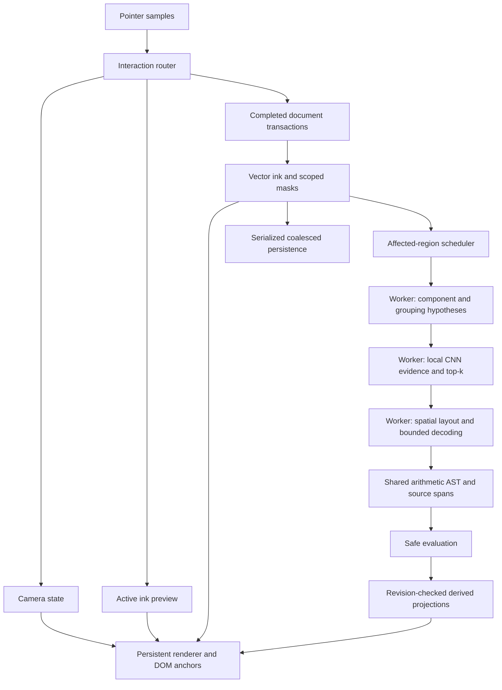

# CalcInk V2 architecture review

Date: 3 October 2026. Task: V2-ARCH-REVIEW. Scope: review the supplied V2 proposal against the current working tree and original repository requirements; suggest changes. The implementation commands in the pasted proposal were treated as material to review. No V2 migration was started.

Candidate: `codex/feat/calcink-baseline`, local base commit `e5e48beb3a698282cc7e0ae14dd5f27375b89a44`, including six existing modified files. Those modifications were preserved: README, App, styles, grouping, recognition E2E and recognition unit tests. Independent read-only reviewers covered ink/viewport and recognition/math. Neither reviewer edited application code.

## Assessment

Keep the direction: paper as the primary surface, an explicit camera and interaction router, handwriting-relative answer layout, contextual diagnostics, and geometry-informed local recognition. Preserve the existing vector document, scoped erasure masks, worker, audited model, safe math, revision guards and offline support.

The proposal is a useful product brief, but needs tighter contracts before implementation. Its greatest risks are rebuilding capabilities already present, losing information before spatial decoding, mixing camera changes with document edits, breaking saved V1 documents, and letting optional extensions delay the arithmetic release.

## What actually exists

| Area                | Current implementation                                                                  | Remaining change                                                              |
| ------------------- | --------------------------------------------------------------------------------------- | ----------------------------------------------------------------------------- |
| Live ink            | Imperative pointer handling and rAF; no per-point React/store/ML calls                  | Active/replay visual parity, profiling and camera support                     |
| Canvas lifetime     | `mountInk` effect depends on store/loading, not recognition                             | Move projection rendering into a persistent renderer lifecycle                |
| Recognition         | Real local Dataset II CNN, WASM worker, top-3 scores and bounds                         | Alternative segmentation, spatial decoding and retained provenance            |
| Job safety          | Per-equation/document/generation/request/model/preprocessing checks                     | Extend versioning to layout/decoder/corrections and improve grouping fairness |
| Math                | Bounded safe parser, precedence, decimals, signs, incomplete/invalid/undefined outcomes | Shared explicit AST when structural math is introduced                        |
| Completion          | Numeric projection requires a recognized terminal equals                                | Quiet incomplete UX and richer per-equation status                            |
| Erasure             | Whole-stroke and persisted target-scoped partial masks, undo/redo                       | Define tool-kind targeting and selection-transform semantics                  |
| Persistence/offline | Validated version-1 IndexedDB snapshots, serialized writes and local asset cache        | Version-2 migration, coalesced saves, cache-update evidence                   |
| UI                  | Page layout, permanent tool controls and conditional Read as section                    | Full viewport paper and floating/contextual controls                          |

Evidence: `src/render/mountInk.ts:74,106,148`, `src/app/App.tsx:126,163`, `src/workers/recognition.worker.ts:132,148`, `src/projection/index.ts:90,156,168`, `src/math/index.ts:88`, `src/persistence/document.ts:15,112`.

## Required revisions to the proposal

### 1. Correct the V1 diagnosis and define a rendering invariant

Sections 2B, 30 and 44 should ask for reproduction and traces rather than assume React recreates ink. Current recognition renders do not remount `mountInk`; committed ink replay is driven by document transactions or size/DPR changes. Clearing and replaying within one frame is not, by itself, proof of visible flicker.

There is a reproduced rendering discrepancy: active drawing paints an initial dot and then separately capped path segments; committed replay paints one joined path. With actual `drawStroke`, a synthetic four-point, width-3 stroke differed by 165 pixels at DPR 1 and 334 pixels at DPR 2 in installed headless Chrome 155.0.8059.27. This is evidence of a visual change at commit, not proof that it accounts for all reported flicker. Existing binary raster unit tests miss browser antialiasing differences.

Also, `App.tsx:163–196` reassigns projection canvas width/height and replaces its observer whenever the projections array changes. Recognition emits fresh arrays even for status changes. Size the canvas only when backing dimensions/DPR change; keep one renderer/observer and schedule projection invalidation through rAF.

Specify: unchanged committed ink must remain visually stable during recognition; active-to-committed drawing must meet an explicit browser pixel tolerance; active samples survive resize/DPR transitions; projection-only changes must not invalidate committed ink.

For reproduction, the diagnostic used points `(12.3,12.7)`, `(31.8,25.2)`, `(48.9,10.6)`, `(63.1,42.9)` on an 80×60 CSS-unit canvas. Compare sequential `drawStroke` calls on prefixes of length 1/2/3/4 with start indices 0/1/2/3 against one full replay. Temporary harness/result: `/private/tmp/calcink-v2-ink-antialias-review.mjs` and `.json`.

### 2. Separate viewport, document and derived state

Sections 4 and 37 need a precise coordinate contract. Define screen points as canvas-local CSS coordinates, with client-to-canvas conversion at the event boundary. For a camera translation `tx,ty` in CSS pixels and scale `s`, use `screen = s * world + translation`; apply DPR only when transforming to backing pixels. Specify the units and sign of pan and zoom arguments.

Use `zoomAt(screenPoint, factor)` with a finite positive scale factor and documented clamping, or clearly define a logarithmic delta. Preserve the world point beneath the zoom anchor. Define fit-content padding, empty-content behavior, whether results count toward fitted bounds, and what reset-to-100% does to translation.

Camera changes get a separate viewport revision. Pan/zoom must not change ink/equation revisions, enter ink undo history, trigger recognition or rewrite geometry. Camera persistence, if desired, belongs to view preferences. Computed projections stay derived; persistent user-controlled placement metadata for future graphs is a separate concern.

Keep world widths for pen/highlighter. Explicitly choose whether the eraser radius is world-sized or screen-sized; if screen-sized, convert radius to world units using scale. Apply the same camera transform to pen, masks, projections, selection and DOM anchor conversion. Define whether paper dots/grid move with the document.

### 3. Introduce the interaction router with the viewport

Move the minimum router from Phase 3 into Phase 2: pan and pinch already require gesture arbitration. Specify states such as idle, drawing, erasing, panning and pinching, with explicit transitions and pointer ownership.

The existing handler rejects non-primary touch and commits partial ink on ordinary pointer cancellation. Define what happens when a second finger promotes a provisional first-finger stroke to pinch. That transition must not leave an accidental line or destructive erase. Distinguish gesture promotion from ordinary cancellation/capture loss; preserve the established cancellation behavior unless deliberately changed.

Freeze the camera while a pen/eraser gesture is active, or explicitly terminate/rebase the gesture. Also define palm rejection policy, Space-pan focus behavior, temporary modifier overrides, lost capture, toolbar focus, and resize mid-gesture. Scope browser page-zoom interception to the paper interaction and test it on declared target browsers/devices.

### 4. Add document migration before highlighter or pressure rendering

Sections 7–10 introduce a persisted schema change, not just a toolbar change. `InkDocument`, persistence validation and worker request validation currently accept version 1 with width/color fields.

Define a version-2 schema and pure V1→V2 migration: old strokes become `kind: pen`, with their original width/color and opacity 1; points, IDs and target-scoped masks remain intact. Reject unknown versions safely and preserve recovery/export options. Document format, IndexedDB database schema and worker protocol versions are separate decisions.

Pressure is already recorded but not used for width. If pressure-sensitive rendering is added, use one geometry policy for active drawing, replay, stroke bounds, hit testing and recognition rasterization; include a fallback for devices without useful pressure data.

Exclude highlighter ink from equation grouping, dirty-equation invalidation, recognition fingerprints and classifier input. Merely filtering immediately before inference can still let a highlight merge equations or retire answers. An erasure that affects only highlights should leave math results current.

### 5. Fix the proposed highlighter layer order

The fixed Layer 3 “active stroke” in Section 8 places an active highlighter above committed pen, while committed highlighter moves below pen. That can change appearance at pen-up.

Specify equivalent active and committed ordering by ink kind. Define opacity per stroke, overlap between separate strokes, self-crossing behavior and compositing. Repeated incremental painting must not accumulate opacity within the same highlighter stroke. Define whether each eraser targets pen, highlighter or both. Retain target-ID mask semantics so later ink is not erased by old masks.

### 6. Let spatial reasoning participate before segmentation becomes final

Sections 11–15 and 37 currently imply that final groups are classified first and spatial interpretation happens afterward. Current grouping irreversibly merges horizontally overlapping strokes and partitions equations using vertical proximity. A later decoder cannot reliably recover information lost in those decisions.

Direct probes reproduced two failures: independent equations at x=0 and x=500 on the same baseline become one equation; a numerator/bar/denominator layout becomes two equation groups, with the numerator and bar merged into one symbol crop. A scale probe also changed two groups at scale 1 into one at scale 0.1 because of absolute size floors. These are synthetic geometry diagnostics, not handwriting-accuracy measurements.

Use components with source provenance → candidate equation regions and symbol groups → local recognition evidence → competing spatial/token hypotheses → bounded decoder → accepted interpretation. Geometry can generate a fraction hypothesis before its bar is committed to a minus crop. Preserve alternative segmentation and visible geometry after masks without changing authoritative vectors.

Begin with baseline/adjacency and arithmetic layout. Superscripts, subscripts and generic containment can remain later vocabulary-specific extensions. Timing is supporting evidence, not a rule that prevents adding a missing dot or equals stroke later.

### 7. Specify recognizer capabilities and bounded decoding

Top-k already reaches the worker result; it is collapsed into expression text at `recognition.worker.ts:148` and not retained by `ProjectionStore`. Revise the task to preserve candidates and source mappings through interpretation and contextual feedback.

The recognizer interface needs audited capabilities/labels, input/preprocessing identity, score semantics, initialization/readiness, typed failures and disposal. Preserve the current artifact-specific validation in its CNN adapter. Raw softmax scores and geometry scores are evidence, not calibrated confidence or directly interchangeable probabilities.

Specify limits on candidate groups, top-k, beam width, equation symbols, AST nodes/depth, inference cache, queue depth and per-job work. Add deterministic ties, abstention and obsolete-job checks between model calls. Keep adaptive grouping, spatial layout and decoding in the worker. One worker is the initial choice; add another only after measurement.

The model has a `÷` label but no `/` label. Parser support for slash already works; it does not establish handwritten slash recognition. Slash needs a verified geometry hypothesis or another audited recognizer. Variables/letters remain deferred.

### 8. Give one module ownership of the AST and split status dimensions

Sections 19, 20 and 38 leave parsing ownership ambiguous. Let the math module own the shared arithmetic AST and pure grammar helpers. The decoder proposes supported token/layout hypotheses using that grammar; the evaluator accepts validated ASTs. Retain `evaluateExpression(text)` as a compatibility adapter while migrating.

Normalize slash, division glyph and spatial fraction to binary `/` for arithmetic. Preserve the original notation and symbol-to-AST spans in separate layout/source metadata. Terminal equals is completion metadata outside the arithmetic AST. Future assignment needs an explicit grammar and dependency/recomputation model; a `Map<string,number>` alone does not specify editing earlier assignments.

Separate lifecycle (`dirty`, `queued`, `recognizing`, `ready`, `failed`) from interpretation/completion and evaluation (`awaiting equals`, `incomplete`, `uncertain`, `invalid`, `valid`, `undefined`). Define valid transitions with discriminated unions. Recognition uncertainty must not become division-by-zero feedback until an interpretation is accepted.

Replace unsupported core examples such as `x + 4` with `2 + 4`, and keep handwritten letters in the extension section. Preserve the original requirement's inline `Undefined` outcome; a contextual “Cannot divide by zero” explanation can accompany it.

### 9. Make projection layout and corrections complete

Derive baseline and body height from plausible number/body symbols, excluding dots, equals bars, fraction bars and outliers; use a geometry fallback when evidence is insufficient. Specify world-unit scaling and avoid a large fixed minimum that overwhelms tiny handwriting. Actual answer font sizing currently uses equals height with a 22–36px clamp, middle alignment and fixed placement offsets (`App.tsx:176`, `projection/index.ts:180`).

Measure text with the actual renderer font and retain real answer bounds. Define long-result/offscreen handling without squeezing text to the remaining viewport width or relocating source ink. Anchor canvas and DOM feedback through the same camera; DOM controls may remain screen-sized. Define keyboard access, a stable accessible equation transcript, restrained live announcements and reduced-motion behavior.

Top-k correction controls also need a state contract: symbol/group IDs, stroke IDs, erase-dependent fingerprint, override storage, undo/redo and invalidation after edits/model changes. Preserve alternatives and source spans in projection diagnostics so a contextual selection remains attached to the correct ink.

### 10. Protect the arithmetic release and measure the whole pipeline

The proposal lists lasso as required in Section 3 but deferred in Section 29; scratch erase is both an addition in Section 10 and Phase 7 work. Choose an explicit V2 core and keep lasso transforms, scratch gestures, variables, plotting and notebook expansion behind later gates. Do not display inactive toolbar tools as implemented.

Document the gesture false-positive policy before enabling scratch erase. It should abstain conservatively, be optional initially, and produce a normal undoable transaction. Selection movement/resizing also needs a decision about moving scoped erase paths and changing effective widths; it is more than adding a lasso outline.

Keep existing inference queue fairness. Improve the global 220ms grouping debounce so unrelated continued writing cannot indefinitely postpone a finished equation: use affected-region scheduling or a bounded maximum wait. Preserve conservative merge/split invalidation and old-response rejection.

Worker placement alone does not remove main-thread cost. `storage.save()` currently validates/clones each snapshot synchronously; grouping requests clone the whole document. Coalesce serialized saves with truthful save status, bound queued work, and measure snapshot/clone/validation costs before adopting incremental worker deltas. Existing 5000-stroke masked replay evidence is approximately 22ms of canvas command submission, already above a 60Hz budget on that fixture; it is not a display-completion measurement. Add viewport culling or dirty-region work only when traces justify it.

Remove the unqualified “60/120 FPS” diagram label. Define measured device/browser/DPR/load scenarios for frame intervals, input-to-visible-ink latency, commit, transfer, grouping, inference, decoding, projection and saving. Preserve offline reload/edit and add V1-document migration, two-version cache update, highlight exclusion, active/replay antialias, pinch arbitration, zoomed erasure and decoder abstention tests.

## Revised boundaries

The camera never writes stroke coordinates. The renderer receives active input directly and document/projection invalidation separately. The shared AST contract does not require rewriting the existing math engine before basic canvas repairs.

## Suggested migration gates

1. Audit and lock the working baseline; correct stale documentation and distinguish local changes from published code. Reproduce the reported flicker and add browser active/replay evidence.
2. Repair rendering parity, projection lifecycle and size/DPR handling. Verify drawing while recognition and saves are active.
3. Land coordinate contracts, minimal interaction router, viewport and full viewport shell together. Verify pinch promotion, zoom anchors and erasure without ink mutations.
4. Land equation layout/contextual projection and versioned document migration; then add highlighter with correct compositing and recognition exclusion.
5. Add the recognizer adapter, provenance, candidate segmentation and bounded decoding. Improve ordinary arithmetic and ambiguous symbols before enabling fractions.
6. Introduce the shared AST compatibility path and gated fraction/slash interpretation with evidence. Retain safe math and stale-response tests.
7. Evaluate optional lasso, scratch, variables and graphs after core arithmetic, offline and performance gates pass.

Each gate needs behavior evidence and applicable existing checks; avoid rebuilding passing foundations or treating a new module name as completion.

## Verification and repository state

- `npm run typecheck` — passed.
- `npm run lint` — passed.
- `npm test` — 10 files, 117 tests passed, including actual bundled ONNX WASM execution. Existing fixtures remain predominantly synthetic.
- `npm run build` — passed; 39 modules transformed, 12 same-origin offline assets. This is build evidence, not runtime performance evidence.
- `npm run format:check` — passed before review-document additions; review documents checked separately afterward.
- `CALCINK_BROWSER_EXECUTABLE='/Applications/Google Chrome.app/Contents/MacOS/Google Chrome' npm run test:e2e` — 4/4 passed in 6.3 seconds, using installed Chrome 155.0.8059.27 and Playwright 1.55.0. Covers real pointer handling, DPR/resize, persistent partial erasure, synthetic actual-model arithmetic and offline reload/edit. Alternate local browser evidence does not establish every supported browser/device.
- Independent focused recognition/math/scheduler checks — 96 tests plus the separate one-test numeric review passed. Independent ink/render/persistence checks — 20 tests passed. Direct grouping and browser antialias diagnostics described above reproduced the additional gaps.
- GitHub readback: baseline PR #4 is open/unmerged, head `c49492ab24533f8f6da4ff191937ed6f3418145b`. Its pull-request workflow run `37042191016` completed successfully. Default-branch progress still describes the specification pack and `src/render/mountInk.ts` returns 404 on default branch. V1 exists locally and in the PR branch; it is not yet on GitHub main. No merge, publication or permission-policy change occurred during this review. Required branch protection was not reverified.

Changed files in this task: this report, an appended review entry in `docs/PROGRESS.md` and validated observations in `docs/DECISIONS.md`. No application behavior, dependency, shared contract, accepted architecture, model or user-authored modification was changed. No commit was created. Proposed changes require implementation and independent review in subsequent work.

Remaining risks: reported full flicker cause is not isolated; live writer/device/all-class accuracy, calibrated confidence, handwritten slash/fraction evidence, long-session memory, representative responsiveness and cache-update validation remain missing. The successful current tests are a regression baseline, not proof that V2 or the competition release is complete.
