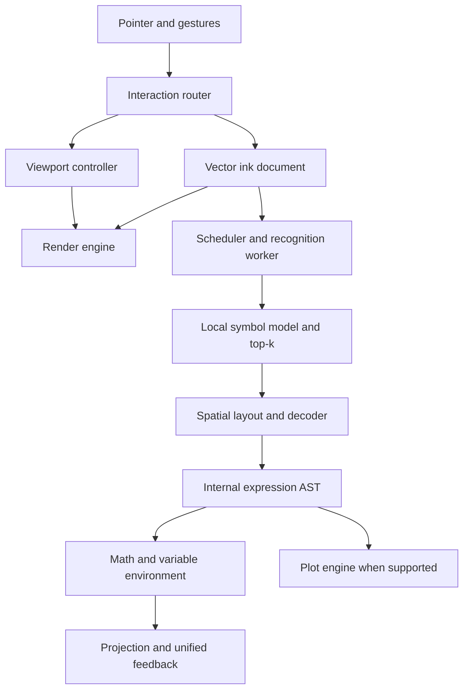

# CalcInk V2 — master implementation and integration prompt

Use this single prompt with Codex connected to the existing CalcInk repository. It combines the V2 architecture specification, the ML specification, the final Figma UI decisions, and an independent review loop. The detailed source specifications are included below; you do not need to paste separate older prompts again. Supply the original full competition PDF if it is not already accessible in the repository/workspace.

---

You are the supervisor and integrator for the EXISTING CalcInk application.

Repository: https://github.com/Shaashwatprasad/CalcInk.git
Figma: https://www.figma.com/design/Y5B5uYxo1fFpUDA3jdHr0S

Implement the complete approved migration incrementally, with real code, tests, runtime validation, independent code review and healthy GitHub maintenance. Preserve working V1 behaviour and all required V2 features. Do not regenerate the application, stop at a plan, substitute a mock classifier in production, or call a set of screenshots a working application.

This instruction authorizes multi-agent planning, implementation, tests, documentation, ordinary feature-branch commits/pushes and draft PRs for this repository. Follow the repository's applicable merge/deployment policy. Prepare a passing, reviewable candidate before any policy-required final approval; do not repeatedly ask permission for ordinary reversible work already authorized.

## 1. Sources, precedence and resolved changes

Read this document fully before assigning work. It has three parts:

1. This master instruction: final UI decisions, architecture integration, task/phase order and review gates.
2. Appendix A: the detailed V2 architecture migration specification.
3. Appendix B: the detailed ML, benchmarking and technical-submission specification.

Read AGENTS.md, START-HERE.md, docs/REQUIREMENTS.md, docs/ARCHITECTURE.md, docs/CONTRACTS.md, docs/MODEL-DECISION.md, docs/MODEL-AUDIT.md when present, docs/BACKLOG.md, docs/VALIDATION.md, docs/DECISIONS.md, docs/PROGRESS.md, docs/AGENT-LOOP.md and docs/GITHUB.md. Audit actual code and Git state: documentation and screenshots may lag behind the running build.

Apply the original competition requirements and the user's latest explicit requirements ahead of earlier proposals. This master instruction supersedes contradictory earlier UI/scope instructions in the appendices. Figma governs the approved appearance; verified code/artifacts establish what actually works. A capability is not implemented merely because it appears in Figma.

Record the following resolved decisions in an ADR and traceability matrix; they are already decided and do not require another preference question:

| Topic | Final requirement |
|---|---|
| Recognition UI | ONE compact combined box for the focused/selected equation: recognized expression/result, optional useful normalization, and contextual state. No second parser card, AST label, AST tree, or technical heading in the product UI. |
| Internal mathematics | Keep a structured AST inside the parser/decoder/evaluator, tests and benchmark output. Removing its UI display does not remove mathematical structure or safe evaluation. |
| Dark recognition box | Retain the chosen dark card treatment, approximately #1A202B, a subtle #333D4E border, readable light expression text and contextual status colours. |
| Light recognition box | Keep the blue identity with the latest softer #5275AE accent, pale #F3F6FC surface, #CCD9EA border and readable #345B8C expression/context text. This refinement supersedes the earlier #2F6FED treatment. Preserve error/warning semantics. |
| Pan icon | Use a 36 × 36 desktop button matching the neighbouring rail tools, a centred 24 × 24 SVG viewport with an optically balanced hand silhouette, consistent stroke weight, and a ≥44 px interactive target on touch. No tiny/narrow hand button. |
| Visual direction | Use DM Sans, the latest restrained grid, readable sentence-case section labels, consistent line icons and tool-specific material previews. Keep the softer blue recognition treatment in light mode; use neutral selected controls. Do not reproduce the superseded wall of identical rounded cards. |
| Variables | x is required now. x = 2 defines a variable; x + 6 = gives 8. Editing x to 4 gives 10; deleting its definition gives a clear unbound state. Earlier “variables only later” scope is superseded for x. |
| x versus × | Preserve multiplication. Do not globally rewrite x into × or pretend the 16-class CNN learns a separate letter class. Audit the running label mapping, retain alternatives and support explicit correction where evidence is ambiguous. |
| Themes | Auto ink resolves to soft white #E4E7EB on dark #10151C paper and dark #252D38 on light paper. The new explicit blue preset is #5275AE in both themes. Explicit colours and saved legacy strokes retain their identities. Both themes use identical geometry-based canonical model tensors. |
| Features | Keep every existing working feature and every mandatory requirement. Responsive relocation is allowed. The requested removal of the visible AST/separate parser card is the only deliberate removal of that UI presentation. |
| Complete implementation | Every in-scope feature and every exposed action must have working behaviour and acceptance evidence. No dead buttons, placeholder handlers, disconnected tool options or untested required workflows. Missing evidence blocks the relevant acceptance gate; it is not a pass. |
| Benchmarks | Published results, measured results, targets and pending evidence are different. Never fill a table with invented accuracy, size, latency, sample counts or reviewer approvals. |

If a new conflict changes an undecided mathematical behaviour, document the evidence and pick a conservative compatible approach when the session already authorizes it. Ask only when a necessary user decision cannot be inferred; continue independent ready work.

## 2. What the final application must do

CalcInk should open as paper occupying nearly the whole usable viewport, with restrained controls and contextual mathematical feedback. Both themes must feel equally complete.

The core experience:

- Write 1 + 2 =. Ink appears immediately; asynchronous recognition never clears or remounts it. A generated 3 appears directly after equals, with a scale and baseline derived from the handwriting.
- Write x = 2, then x + 6 =. The definition is accepted without requiring a second equals, and the dependent answer is 8. Edit, erase, undo, redo and reload preserve correct semantics.
- Write 2 × 3 =. It remains multiplication, yielding 6. If a crossing stroke is genuinely ambiguous, choose “Variable x” or “Multiply ×” inside the same feedback box.
- Write 5 +. It is incomplete, not an alarming invalid expression.
- Write 2 ÷ 0 =. Show a concise divide-by-zero/undefined state without an unhandled exception or stale valid answer.
- Use pen, pencil, highlighter, erasers, selection, text, shapes, regions and arrows according to their actual documented roles. An annotation must not accidentally become an operand.
- Pan, zoom, change theme or paper, and resize the window without altering stored geometry or restarting the model.
- Open tool options, use the mobile drawer, save/reload and work offline after required assets have been obtained. No control change or recognition failure loses a notebook.

Treat all Figma sample expressions/results as design examples, not live ML evidence. Recognition, parsing, evaluation, dependency updates and projection must each be demonstrated with the actual application.

## 3. Audit and preserve the complete feature set

Create docs/FEATURE-PRESERVATION.md before major changes. For every feature record:

requirement ID; source requirement; working V1 behaviour or proposed V2 status; implementation paths; final UI location; acceptance checks; phase/task owner; implemented/tested/pending/deferred status; evidence.

At minimum inventory:

- Select; Pen; Pencil; Highlighter and colour/width/opacity options; Lasso; whole-stroke Eraser; true partial/pixel Eraser and radius; Text; Shapes; Box Region; Arrow; Hand/Pan; More/Canvas settings; Help.
- Theme; undo/redo; clear with confirmation; zoom; 100%; reset view; fit content; keyboard shortcuts; temporary Space pan; trackpad/wheel/touch navigation as appropriate.
- Adaptive ink and explicit colours; pressure behaviour; None/Dots/Grid/Ruled/Ruled wide; spacing/intensity; infinite canvas; free 2D pan and constrained vertical mode.
- Notebook naming, autosave, IndexedDB recovery, pages/documents already implemented or required, import/export and their supported formats, hide/show results, copy expression/answer, selection move/resize/duplicate and history where implemented or required.
- Arithmetic, terminals, decimals, negatives, precedence, safe evaluation, malformed/incomplete/undefined handling, automatic updates, on-device recognition, offline operation, and every original R01–R12 requirement.
- V2 scratch-to-erase, structured fractions/division notations, plotting, richer gestures and notebook extensions. Preserve implemented versions. If a source explicitly makes an extension optional or conditional and it is not already implemented, retain it in the backlog with a reason and a clean extension boundary. Do not silently delete it or represent it as delivered.
- The new required variable x workflow and the single combined recognition box.

The checklist above is a minimum, not permission to omit features discovered in the original PS, the detailed V2 appendix or the repository. Distinguish “preserved existing feature” from “new proposed capability.” A hidden menu must remain reachable by keyboard and touch.

Preserve uncommitted user work, stored documents, undo semantics, equation identity and existing supported import/export formats. Add versioned migrations and old-format fixtures if persistence changes. Explicitly test recovery from malformed/imported data and unsupported versions without destructive overwrite.

## 4. Integrate the architecture rather than pasting separate systems

Reuse correct V1 modules and repair violations. Introduce or adapt the following boundaries, using repository naming rather than forcing a new directory tree:

| Boundary | Responsibility | Must not do |
|---|---|---|
| CanvasShell / React UI | Layout, themes, toolbars, menus, sheets, dialogs, accessible contextual feedback | Render the live notebook on every pointer sample |
| InteractionRouter | Tool/modifier/pointer/gesture state, capture, cancellation, draw-versus-pan decisions | Scatter tool semantics across unrelated React callbacks |
| ViewportController | screenToWorld, worldToScreen, panBy, zoomAt, reset, fit content | Permanently scale or translate document strokes |
| InkDocument and transactions | Authoritative vector geometry, eligibility, erasure, revisions, history, persistence schema | Treat raster screenshots or generated answers as source ink |
| RenderEngine | Immediate active ink, committed layers, transforms, dirty replay, display/DPR lifecycle | Run inference, parse math, serialize persistence in pointermove |
| Scheduler and worker | Equation-local coalescing, top-k model work, grouping, canonical preprocessing, cache/version checks | Accept obsolete jobs or block pointer input |
| Spatial layout / decoder | Geometry, merge/split hypotheses, bounded alternatives, source alignment and internal AST | Force a valid expression when ink evidence remains uncertain |
| Math and VariableEnvironment | Typed parsing, safe evaluation, notebook-scoped definitions and dependency invalidation | eval/new Function or blind text substitution |
| ProjectionManager | Inline answer anchors/scale, current revision, contextual state and hit regions | Modify original strokes or display an old answer as current |
| Persistence / Offline / Metrics | Versioned save/recovery, static runtime/model assets, instrumentation | Production cloud inference/math or fabricated measurement |

Keep these contracts explicit in docs/CONTRACTS.md. Agree changes before parallel implementation.

Persistent data should include stable stroke/object IDs, kind, geometry, pressure/timestamps where available, colour semantics, erase masks or equivalent true partial-erasure representation, history-compatible transactions, and document format version. Highlighters/text/shapes/arrows/answers require explicit recognition eligibility, not just a cosmetic colour test.

Recognition work/results must carry document identity, equation identity/revision, model version/hash, preprocessing version, effective input geometry identity and source-stroke links. Rendering appearance and camera movement must not increment mathematical revisions when the eligible ink did not change. Moving an expression in a way that changes spatial relationships or selection scaling must invalidate affected grouping/decoding correctly.

Model outputs retain raw top-k scores and bounds before interpreting tokens. Confidence is calibrated only if validation establishes calibration; raw softmax is not automatically a correctness probability.

Define one view model for the combined feedback box: expression/result text, optional useful normalization, concise message, alternatives/correction actions, retry action and current/pending/error state. Internal AST, tensors, worker queue details and raw probabilities belong in developer/test artifacts rather than the product card.

## 5. Exact UI integration instructions

Inspect the final Figma components and main screens. Do not implement the superseded dual-box screenshots or archived reference layers. Do not duplicate every Figma board as an application page: tool/state boards and annotation pages are specifications.

Current main frame references:

| Screen/spec | Figma node |
|---|---|
| Dark desktop | 2:5 |
| Light desktop | 9:6 |
| Numbered annotated guide | 9:1292 |
| Arrow-label guide | 9:2578 |
| Dark mobile / all-tools drawer | 29:277 / 29:312 |
| Light mobile / all-tools drawer | 29:3044 / 29:3079 |
| Dark / light tablet | 34:64 / 35:54 |
| Dark / light tool and state boards | 28:6 / 29:28 |
| Shared Hand component | 25:2 |
| Unified recognition variant set | 25:59 |

Reinspect IDs and contents before implementation; Figma may be edited after this prompt. The final decisions in section 1 remain authoritative.

Use the repository's frontend stack, existing components and coherent SVG icon family. Do not copy Unicode placeholder icons merely because they exist in an early mockup. Match the latest approved typography: the CalcInk wordmark uses DM Sans Medium at 21 px with 28 px line height and approximately −0.45 px letter spacing; controls use DM Sans Regular at 13/20 px and secondary text at 12/18 px. Tool headings use DM Sans Medium at 21/28 px with approximately −0.25 px tracking. Primary recognition text uses DM Sans Medium at 16/24 px, with supporting rows in DM Sans Regular at 12/18 px. Small section labels use DM Sans Medium at 12/18 px, natural spacing and sentence case (for example, “01 · Drawing”); replace the earlier tiny, widely tracked uppercase monospaced labels. Retain monospace only where it serves a genuine developer or numerical-alignment purpose. Render actual structured mathematics with the project's appropriate math renderer where needed. Verify font licensing/loading/fallbacks; self-host the selected licensed font files and cache them for offline operation. Use a stable system sans-serif fallback and verify layout before/after font loading; Figma is not evidence that the app already ships those fonts.

The visual refinement is inspired by disciplined grids and clear hierarchy; it is not a request to impose a generic Swiss-style template. Follow these concrete decisions:

- Keep the application header open and quiet. Avoid a large filled rounded header container and excessive bold labels. Preserve every header action and accessible name.
- Use a coherent 24 px SVG icon family with approximately 1.65 px strokes, rounded joins/caps and transparent containers. Balance silhouettes optically, including Hand/Pan; identical bounding boxes alone do not guarantee equal perceived size. Reuse appropriate existing icons where they match the approved Figma family.
- Group the desktop rail into selection tools, drawing/annotation tools, and navigation/utilities, separated by thin rules. Current order is Select, Lasso; Pen, Eraser, Text, Shapes, Box Region, Arrow; Hand/Pan, More/Canvas, Help. Pen still exposes pencil and highlighter. Keep keyboard navigation consistent with the visible order.
- Use neutral selected controls: charcoal (#22262C) with white content in light mode, and soft light (#E4E7EB) with dark (#171B22) content in dark mode. Use the muted blue #5275AE for the light recognition accent and the new explicit blue ink preset. Dark-theme UI accent can use #90AAD6; it must not change the identity of an explicit blue stroke. Warning/error colours keep their semantics.
- Prefer small control radii (approximately 3–4 px), 8 px for the rail/option surfaces/recognition box, and 12 px for the paper viewport. Use subtle boundaries and spacing instead of shadows and nested rounded cards. Reinspect Figma for exact dimensions.
- Give each tool's options useful character: a stroke preview for pen/pencil, translucent bands for highlighter and an erase preview for eraser. Preview geometry is decorative UI data, never notebook ink, a recognition input or an undo transaction. It reflects the selected options without running inference.
- Use concise product copy and clear labels. Do not put architecture terms, benchmark claims or implementation instructions into tool panels. Notebook commands can be quiet menu rows rather than filled button pills; their functions remain intact.
- The tool/state specification boards use open numbered sections, consistent alignment, thin top rules and a three-column grid on the large board. They document the controls; the working application still opens only one contextual tool panel at a time. Do not ship nine simultaneous option panels to imitate the board.
- Apply the same hierarchy in both themes and all responsive layouts, resolving actual foreground/background colours correctly. Check contrast, focus visibility, touch targets and long/localized content; do not sacrifice legibility for visual restraint.

Build reusable ToolButton, tool-specific option panels, menu/sheet, ThemeProvider/tokens, UnifiedRecognitionBox and accessible OverlayController as appropriate. Derive themes from semantic tokens rather than duplicated screens or inverted screenshots.

The combined recognition box:
- Shows expression/result, an optional normalization row only when helpful, and concise contextual feedback. No heading and no AST display.
- Uses one component with theme/state variants, not separate “READ AS,” parser, AST and error cards stacked together.
- Represents Recognizing, Incomplete, Uncertain, Valid, Invalid, Undefined, Unavailable, VariableDefined and UnboundVariable. Keep neutral/idle states quiet.
- Displays x/× alternatives and Retry inside this box when relevant. Preserve error readability and meaning in both themes.
- Provides one box for the currently focused/selected equation, or the latest relevant equation when none is selected. Other equations retain inline answer/uncertainty anchors; do not permanently pile large cards on every equation. Define deterministic selection and offscreen positioning behaviour.
- Does not intercept ordinary writing unnecessarily. On narrow screens, allow a compact/collapsible presentation preserving access to feedback, rather than covering the entire writing area.
- Uses live regions judiciously; avoid announcing every pointer sample or repeating unchanged states.

Auto ink:
- Default strokes use semantic Auto, resolving to soft white #E4E7EB on dark #10151C paper and dark #252D38 on light paper. Avoid pure-white defaults and glow effects on the dark canvas. UI foreground and dark recognition expression text also use #E4E7EB.
- The new explicit blue preset is #5275AE, and the new white preset is soft white #E4E7EB. These are values for newly chosen preset colours. Keep existing explicit #FFFFFF, older blue values, imported custom colours and user selections exactly as saved; do not recolour legacy documents. Label the white swatch accessibly as “Soft white” while retaining concise visible wording where space is limited.
- Store explicit colours separately. Changing themes must not silently recolour explicit strokes.
- Offer Auto or a clear contrast hint for an explicit invisible colour; avoid rewriting saved choices.
- Keep highlighter, background patterns, answers, errors and selection contrast usable.
- Rasterize geometry offscreen into the verified canonical model polarity, independent of visible paper, grids or cosmetic colours.
- Keep supporting recognition text fully legible: the normalization row now uses full opacity rather than the earlier 65% treatment. Validate actual composited colours. The selected light recognition text/background pair (#345B8C on #F3F6FC) has approximately 6.4:1 contrast; Auto ink on dark paper (#E4E7EB on #10151C) approximately 14.8:1. These calculations establish contrast for these pairs, not an objective guarantee of eye comfort or certification of the complete UI. Verify other states, focus indicators and device brightness with the working application.

Tool options:
- At most one panel is open. Tool trigger toggles it; another tool replaces it; Escape/outside interaction dismisses it and returns focus appropriately.
- Pen/Pencil retains mode, colours, width and pressure; Highlighter retains colours/width/opacity; Eraser retains whole/partial modes and radius; Hand retains free/vertical pan, zoom/reset/fit content where supported; every other tool retains its documented options.
- Pointer-down on paper closes an ordinary non-modal popover and continues the intended draw/pan interaction without dropping the first point. Dialogs and modal mobile sheets have an explicit dismissal policy so accidental drawing does not happen through a modal backdrop.
- Popovers never clear/remount ink, reset history or restart recognition.
- Clear opens a real confirmation; export/import/notebook commands retain existing semantics.

Gestures:
- Pen writes, Hand moves. Space temporarily pans and reliably restores the previous tool.
- Track pointer capture, pointercancel, lost capture, blur and switching gestures; no ghost stroke or stuck pan mode.
- Two-finger touch pan/pinch must not commit those touches as ink. Distinguish stylus and touch behaviour conservatively on supported devices.
- Use cursor/gesture-centred zoom and correct screen/world conversion, including offsets and DPR. Viewport updates move projections and hit regions consistently.

Responsive behaviour:
- Starting breakpoints are desktop ≥1024 px, tablet 600–1023 px and mobile <600 px. Adjust to content evidence; document a change.
- Desktop: rail and one contextual panel. Tablet: compact controls, with sheets when floating options would hide writing. Mobile: bottom dock and all-tools drawer, separate options sheet, safe-area padding.
- Touch targets are ≥44 px even when the optical icon or desktop button is smaller. Keyboard focus, accessible names, shortcuts, selected states and non-hover access remain.
- Check widths 1440, 1024, 834, 768, 600, 390, 360 and 320, plus landscape/browser zoom/DPR. No unreachable tool, overflow or clipped confirmation.
- A resize preserves the document, active tool, history, assignments and pending job guards. Change backing stores only when dimensions actually change.

## 6. Variable evaluation and recognition capability

The user's observed build displays x in READ AS but fails to evaluate x = 2 and x + 6 =. Inspect the exact build and mapping. A displayed glyph, a recognizer class, an Identifier AST and a valid variable environment are separate capabilities.

Audit findings from previously inspected main are hints to reverify, not eternal facts: its tokenizer rejects identifiers, and the Rafi Dataset II baseline has sixteen canonical classes including multiplication, not an independently trained letter x class.

Implement:
1. Identifier and Assignment nodes in the internal AST.
2. A complete assignment grammar: x = 2 is a valid definition when its RHS is complete; it does not wait for another equals.
3. An ordinary calculation grammar: x + 6 = evaluates when complete and unambiguous.
4. Notebook-scoped environment and dependency/revision tracking. Document deterministic duplicate-definition and dependency policies; handle invalid/unbound/cyclic/self-referential definitions safely.
5. Edit/erase/undo/redo/reload/import isolation and recomputation. An obsolete variable snapshot cannot publish a current-looking answer.
6. Multiplication × remains multiplication. Contextual decoding and explicit correction may resolve ambiguous crossing ink, but do not label that process a learned seventeenth CNN class.
7. A separately verified model/vocabulary if automatic x recognition needs a replacement. Explicit correction must be labelled as user-assisted, with separate benchmark reporting. Automatic recognition quality is not satisfied by evaluator-only fixtures.
8. No fabricated support for other letters/functions/powers/plotting. Retain supported extensions; conditional future work remains tracked.

Minimum regression sequence: define x=2; evaluate x+6=8; change definition to 4 → 10; erase → Define x first; undo/redo → correct state; different notebook → no leaked x; reload → correct state; ambiguous x/× → explicit choice; 2×3=6; invalid definition/division by zero/cycle → safe state; stale worker/dependency response → rejected.

## 7. Multi-agent organization and mandatory feedback loop

Use the actual available agent tools. Assign independent ready modules to specialist implementers with explicit file ownership and contracts. The supervisor alone owns shared configuration/lockfile changes and integration. Use isolated worktrees/branches where supported; never let multiple agents change the same Git index or checkout concurrently.

Roles may include planner, ink/viewport implementer, tools/frontend implementer, math/variable implementer, ML/benchmark implementer, app/offline implementer, independent reviewer and documentation/presenter. Two specialist tester roles are MANDATORY: ML Implementation Tester and Product Interaction / Feature Tester. They produce executable suites as specified below and test work independently of its implementation author. Roles do not require permanent simultaneous agents; schedule them within available concurrency limits. Do not spawn recursively without a supervisor-assigned dependency.

After EVERY completed task, launch an independent code-review agent that did not author that task. After EVERY phase, launch a fresh phase-review agent to inspect the complete integrated phase, interactions with earlier phases, feature preservation and documentation. Task acceptance does not replace phase review.

The compulsory loop is:

plan a bounded task with acceptance cases → implement → implementer checks → relevant specialist tester suites and independent task review → fix findings → rerun affected cases and relevant regressions → independent re-review → integrate on the integration branch → both tester tracks assess the integrated head → phase review → repair/retest/re-review if needed → checkpoint GitHub/docs → next ready phase.

No task/phase passes merely because its implementer says it is done. Do not call a self-check independent review. If actual agent tools are unavailable, state that limitation, perform a separate review pass with explicit evidence, and mark the independent-review requirement pending rather than fabricating a reviewer.

Each task card contains:
- ID and requirement IDs.
- Goal, dependencies and owned paths.
- Input/output contracts and allowed shared changes.
- Implementation approach and acceptance behaviour.
- Expected meaningful tests/runtime evidence.
- Branch/worktree, baseline commit and expected deliverables.

Implementer returns task ID, branch/commit or exact diff, changed files, behaviour, contract changes, exact commands/outcomes, risks and pending work. A reviewer receives those claims plus the real baseline/head commits and source requirements, not just a prose summary.

Reviewer instructions:
- Inspect all new/changed code and relevant callers, types, migrations, tests and failure paths.
- Review against the original requirement and the final UI decisions; inspect unchanged code when the change depends on it.
- Reproduce relevant checks and critical behaviour. Review a test for whether it can actually catch the failure, not whether it mirrors the implementation.
- Check stale jobs, variable dependencies, erase masks, coordinate transforms, resource limits, race conditions, colour invariance, worker failure, persistence, accessibility and offline/model assets where relevant.
- Report a concrete location, severity, reproducible trigger, expected/actual behaviour, risk and recommended fix for each finding. Separate verified defects from hypotheses.
- Identify missing evidence and scope/feature regressions. Do not accept mocks as real-model proof or synthetic replay as handwriting accuracy.
- Return ACCEPTED, CHANGES_REQUIRED or BLOCKED_WITH_EVIDENCE; record the exact reviewed head commit. Agent acceptance is not a fabricated human GitHub approval.

The supervisor triages every finding. Fix critical/high correctness/data-loss/security defects and material acceptance gaps before integration. Track minor items with reason, owner and acceptance consequence. Do not bury a requested feature or a failing gate as “optional polish.” Re-review the changed head; earlier acceptance becomes stale when relevant code changes.

After three unsuccessful attempts at the same failure, diagnose the underlying contract/environment issue, record a concrete blocker and new approach instead of looping blindly. Continue unrelated ready tasks. This limit is not permission to waive a defect, invent a pass or abandon a fix with a new evidenced approach.

Persist review reports/task ledger in repository conventions, such as docs/reviews/ and docs/PROGRESS.md. Maintain a resumable head/review/check state. This feedback loop runs during active implementation sessions; do not claim agents will monitor forever after a session ends.

### 7.1. Build two executable testing systems

This is implementation work, not a request for two prose checklists. Starting in Phase 0, build and maintain two runnable, version-controlled testing systems using the repository's current unit/integration/browser tooling where suitable. Reuse useful tests, repair weak ones and add missing behavioural coverage. The supervisor approves test contracts and owns shared package/CI configuration; assign tester-owned paths to avoid conflicts. Review changes to the harnesses themselves independently.

Both testers receive the actual requirements, feature inventory, original reproduction cases, source diff and exact integrated commit. They derive expected outcomes from requirements and labelled truth, not by copying implementation output into snapshots. Tests should catch incorrect behaviour even when the screen looks convincing. Use isolated test notebooks and seeded, reproducible fixtures; never erase or mutate the user's real documents.

**Tester A — ML Implementation Tester** owns the recognition integration/regression harness and benchmark verification. Implement these layers:

| Layer | Required executable evidence |
|---|---|
| Artifact and runtime contract | Verify the real model bytes/hash/vocabulary, input shape/layout/dtype/polarity/range, output dimensions and label order, deployable worker/WASM assets, model initialization and provider selection. Detect LFS pointers, corrupt/truncated assets, incompatible outputs and failed loading. Check the production bundle and cached/offline startup. |
| Canonical preprocessing | Known vector-to-raster/tensor fixtures covering bounds, padding, scaling, aspect ratio, antialiasing, transparent backgrounds, tiny dots, empty/noise-only input and extreme coordinates. Assert identical canonical tensors for the same eligible geometry under light/dark, explicit cosmetic colours and camera transforms. Verify annotation/highlighter/generated-answer exclusion. Test width/pressure cases according to the actual preprocessing contract rather than assuming them away. |
| Grouping and spatial interpretation | Multi-stroke equals/divide/multiply; late dots/crossbars; close/touching digits; decimals; minus versus equals; slash/÷/supported stacked fractions; multiple equations; x/× alternatives and merge/split bounds. Ground-truth grouping fixtures check exact source-stroke membership and expected structure, not just final numeric equality. |
| Real inference and decoder | Run a small reproducible real-model suite in the production browser worker plus a suitable reference runtime where available. Check scores/top-k/output mapping and justified numerical parity tolerances; do not require bit-identical floating-point outputs across different providers. Expose per-class failures, unsupported inputs and honest uncertainty. Keep fake-provider tests separate and explicitly marked. |
| Scheduling and mathematical integration | Exercise the entire ink → worker → grouping/model → internal AST → evaluation/variable environment → visible answer path. Reorder/delay responses; rapidly edit/erase/undo/redo; switch/delete notebooks/equations; retry after a worker failure; test cache identities, coalescing and backpressure. No obsolete result or variable snapshot may become current. Verify x definitions/dependencies/isolation, multiplication, incomplete/invalid/undefined/unbound states and annotation exclusion. |
| Quality and performance | Execute section 9 and Appendix B's frozen, writer-disjoint benchmark protocol; generate actual predictions, grouping/AST/answer metrics, confusion cases, coverage/abstention, confidence intervals and complete latency traces. Separate real handwriting accuracy from deterministic/synthetic regressions; separate cold/warm/cache-hit timing and model/pipeline speed. Run stress/performance experiments without silently substituting those results for human accuracy. |

Use independently specified expected mathematical outcomes and useful invariant/property tests for parser/evaluator/dependency correctness. Fuzz malformed tokens, extreme input, cancellation and supported grammar boundaries with reproducible seeds and resource limits. A successful parser/evaluator fixture is not evidence that handwritten symbols were recognized correctly.

Tests with controlled fake outputs are valuable for deterministic state/error/race coverage. They cannot satisfy the real-model integration gate or accuracy report. At least the real-model browser smoke and the available frozen-corpus evaluation must run against the actual deployed model/preprocessor. If labelled ink or physical hardware is missing, finish the executable capture/replay tools and available checks, record exactly what remains blocked and keep the affected acceptance gate pending.

**Tester B — Product Interaction / Feature Tester** owns browser interaction suites and feature completeness. Create a version-controlled action/feature registry tied to docs/FEATURE-PRESERVATION.md. Include every exposed button, tool, menu/submenu item, swatch, slider, text field, keyboard shortcut, gesture, dialog choice, correction action and responsive replacement. Include features discovered in code and the PS, not only the eleven visible rail tools.

Each action entry needs: stable action/requirement ID; UI location/accessibility locator; supported layout/theme/input; precondition; trigger; expected visible outcome; expected document/tool/viewport/history/persistence effect where applicable; cancellation/error behaviour; dependent workflow; executable test IDs; latest exact-head result and evidence. Intentional disabled states need a stated reason and tests showing when the action becomes available. A missing handler is not a disabled-state policy.

Implement the following browser workflows against the real production build:

| Workflow | Required assertions |
|---|---|
| Drawing tools and settings | Select pen/pencil/highlighter, change colour/width/opacity/pressure, draw, and verify the resulting geometry/style/eligibility and persistence. Opening a panel alone does not prove its options work. |
| Erasers and history | Whole-stroke and genuine partial erase/radius, affected geometry, answer invalidation, undo/redo restoration, and save/reload. Verify that a partial-erasure UI changes the actual erase mask/geometry rather than merely hiding a stroke. |
| Selection and objects | Select/lasso, move/resize/duplicate/delete as supported/required; text entry/editing; shapes, regions and arrows; correct grouping effects and annotation exclusion. Verify the correct object is changed and history restores it. |
| Navigation | Hand/free/vertical pan, zoom controls, 100%/reset/fit, Space temporary pan, wheel/trackpad and emulated touch/pinch. Check screen/world conversion, hit testing, projection movement and unchanged document coordinates under camera-only changes. |
| Panels, focus and dialogs | Every tool's options, one-open-panel policy, tool switching, Escape/outside close, focus restoration, clear confirmation/cancel and modal backdrop behaviour. A paper click that closes an ordinary popover must still retain the first intended ink point. |
| Themes and paper | Both defaults, Auto ink, explicit colour identity, readable soft-white dark ink, muted blue recognition, every paper mode/spacing/intensity/infinite-canvas option, and preserved documents/history/worker state through theme changes. |
| Math and feedback | Ordinary calculation, required x sequence, x/× correction, all nine recognition states, Retry, contextual single box, inline answer scale/anchor, hide/show and copy actions where required. Assert actual values/state and no visible AST; do not accept static example text. |
| Notebook lifecycle | Name/create/open/switch supported notebooks/pages; autosave/reload; existing import/export formats and round trips; corrupt/unsupported imports; non-destructive recovery; storage failure. Confirm downloaded/exported content and restored ink, not just a toast. |
| Responsive access | Every required feature reachable on desktop, tablet and mobile in both themes; drawer/sheet alternatives, focus, touch targets and safe areas. Test the specified breakpoint widths for overflow/clipping and core workflows across representative layouts. No hover-only access. |
| Failures and offline | Real cached offline reload followed by edit/evaluate/save; model/worker/load failure and recovery; rapid edits, pointer cancellation/blur/lost capture, slow responses and resize during drawing/recognition. No lost ink, stale answer, stuck tool or uncaught expected error. |
| Help, shortcuts and secondary actions | All help/menu/canvas commands, keyboard equivalents, intended links, escape/reset/cancel paths and any other exposed action from the registry. Verify meaningful outcomes and correctly handled permissions/capability absence where relevant. |

Use accessible, stable locators and state-aware assertions, not brittle screen coordinates or arbitrary sleeps. A generic crawler that clicks buttons without checking effects is discovery support only. Read-only inspection of document/tool state may supplement browser assertions; do not invoke application internals to perform the operation being claimed as a successful UI interaction. Core recognition workflows must use real ink replay and real inference; controlled fixtures may separately induce otherwise hard-to-reproduce feedback/error states.

Treat unexpected console/page errors, unhandled promise rejections, failed required asset requests and input blocking as test failures with context. Capture traces/screenshots, relevant document state and worker/revision logs on failure. Emulation verifies browser behaviour; record physical stylus/touch checks separately without calling emulated input real-device evidence.

### 7.2. Completeness gates and reproducible reports

Wire both suites into executable scripts and applicable CI. Adapt naming to existing conventions; provide one documented command for each track plus an aggregate release-check command. Keep fast deterministic checks on relevant changes, real-model browser smoke on integrated changes, and larger accuracy/performance runs on an appropriate scheduled/manual or stable benchmark runner. Include fast fixture/report-schema checks in ordinary CI even when the full corpus run is separate. Do not make ordinary CI depend on unstable hardware-specific millisecond thresholds.

Each run produces a machine-readable report and a concise human summary containing: exact commit/build/model/preprocessor/corpus hashes as relevant; command/configuration; environment/browser/device; selected test IDs; passed/failed/skipped/blocked counts; seed; defect reproductions; artifacts; and pass/fail against applicable gates. Record initial failures and retries; a later retry must not erase evidence of flakiness. Fail the process for test failures or missing required cases; skipped/blocked checks are never counted as passed.

Compute coverage from the declared requirement/action registry: covered, uncovered and unimplemented IDs with explicit denominators. Require 100% mapping of in-scope requirements and exposed actions to meaningful acceptance cases, and passing required cases on the current integrated head. This is feature/action traceability, not proof of exhaustive state-space coverage or a demand for arbitrary 100% source-line coverage. Detect registry drift when controls/features are added; retain exploratory/manual inspection to find omitted actions.

A task passes after its relevant tester cases and independent review pass. Every phase requires reports from both tester tracks on the same integrated head: affected suites plus accumulated relevant regressions; explicitly justify unchanged-track scope. New changes invalidate relevant earlier reports. Final acceptance runs the full required deterministic/browser gates, the real-model checks, available held-out quality evaluation and required physical-device evidence, with no unexplained skips.

No dangling features: every in-scope feature must be implemented and verified, with zero unexplained unmapped actions, placeholder handlers, disconnected options or required failing cases. Complete full workflows rather than counting isolated clicks. A feature missing from a menu after redesign is a regression. Keep genuinely optional, unapproved extensions distinct from the delivered feature set; an exposed control or an already working V1 feature cannot be relabelled optional to avoid fixing it.

The testers report PASS, FAIL or BLOCKED_WITH_EVIDENCE; the independent reviewer inspects implementation and test validity; the supervisor owns repair and final acceptance. Fix each verified failure, add a regression case that reproduces it, rerun affected suites and obtain re-review. Do not weaken assertions, delete tests, introduce unexplained skips, hardcode fixture answers, tune on held-out writers or suppress errors to make reports green. If external samples/hardware are genuinely unavailable, preserve the blocker and continue independent ready work; do not claim the whole application or ML acceptance is complete.

## 8. Phase plan with executable gates

This master plan refines the older V2 sequence. Keep phase dependencies; split work into small reviewable tasks. Bring the benchmark harness/instrumentation forward so V2 is compared against a preserved baseline. Mathematical variable support is required in Phase 4, not postponed as an optional Phase 7 extension.

| Phase | Implement | Gate before marking accepted |
|---|---|---|
| 0 — Audit, requirements and baseline | Verify Git/source/runtime; reproduce flicker, spacing and x failure; feature/action registry; contracts/ADRs; establish both executable tester tracks, labelled replay harness, timings and baseline hashes | Baseline runs/reports reproduced; known failures and missing data recorded; test discovery/traceability initialized; independent audit and harness review |
| 1 — Stable ink and projection lifecycle | Repair pointer/render separation, canvas dimensions/DPR/resize, active/committed replay and answer invalidation; keep drawing through model work/failure | No reproducible recognition-caused blank ink frame in tested traces; history/erase/resize/stale-result checks pass; independent phase review |
| 2 — Viewport and paper shell | World coordinates; pan/zoom/reset/fit; gesture routing; full-viewport paper shell; input/hit-region/projection transforms | Roundtrip, zoom-anchor, pan, cancellation and document migration checks; production browser mouse/touch evidence where available |
| 3 — Tools, themes and controlled options | Preserve/add required tools; colour semantics/highlighter/erasers; one-open-panel model; final Pan dimensions; accessible controls | Tool eligibility, history, erasure and persistence pass; canonical theme invariance; all original controls reachable; no flicker regression |
| 4 — Safe math, required x and unified feedback | Internal AST/assignment/environment/dependencies; nine states; inline answer sizing; final single box with blue/light and selected dark styling; remove visible AST | Variable sequence and × cases pass; stale dependencies rejected; arithmetic preserved; one box and no AST in all layouts; task and phase reviews |
| 5 — Recognition V2 | Real recognizer adapter; verified preprocessing; top-k; adaptive grouping; bounded merge/split/layout/decoding; cache and local scheduler | Real model integration/parity and stale-job checks pass; ablation reports use frozen available data; incomplete/uncertain cases stay honest |
| 6 — Structural division and specified math | Slash/÷/supported stacked fractions to common AST division; spatial evidence; late dots/crossbars; preserve parser capabilities | Equivalent value/undefined tests, supported-scope handwriting evidence and explicit unsupported cases; no confident invented structure |
| 7 — Responsive and complete application lifecycle | Finish desktop/tablet/mobile interactions; notebook/save/load/import/export/recovery; offline assets; accessibility; required scratch/selection/QoL features not yet accepted | Production E2E, actual offline reload/edit, compatibility fixtures, responsive/feature matrix; public deployment candidate ready when required |
| 8 — Model comparison and measured acceptance | Evaluate relevant pretrained alternative; classifier and full-pipeline benchmarks; cold/warm timing/frames/size/memory; report decision and PS justification | Counts/provenance/devices/splits/hashes/intervals/raw outputs; actual pass/fail/pending targets; independent benchmark methodology review |
| 9 — Final integration and submission | Cross-phase review; full ML and product tester suites; real-model browser checks; docs/README/licenses; complete action/feature traceability; reviewable release/PR | Both tester reports and independent final review on latest head; required CI/gates pass; no dangling features, unexplained unmapped actions or undisclosed missing evidence; follow merge/deployment policy |

Do not wait until Phase 8 to discover the model cannot run or to capture the baseline. Phase 0 starts the harness/artifact audit; subsequent phases collect measurements/ablations without tuning on held-out test writers.

Where a later phase's task is truly independent of unresolved work, continue it after contract review, while marking dependent acceptance pending. Do not start an optional creative extension while core ink remains broken.

Function plotting, broader letters/functions and conditional PDF/page features follow their original required/optional status and actual existing implementation. Preserve them if already working; implement mandatory PS/user requirements; retain optional extensions in the backlog with rationale. Architecture preparation alone is not feature delivery.

At every phase: independent task reviews, both tester tracks' integrated-head reports, fresh phase review, findings/fixes/retest/re-review, docs update and Git checkpoint. A phase table is not permission to bypass the per-task loop.

## 9. ML evidence and selection requirements

Appendix B supplies the detailed protocol and must be implemented, not treated as background prose.

Reverify the current model artifact and source: previous inspection found Rafi Dataset II FP32 ONNX, 9,310,762 model bytes, float32 NHWC [1,50,50,3], RGB black-on-white /255, sixteen outputs, ONNX Runtime Web 1.22.0 and a worker/WASM baseline. These are audit findings to check at the current commit. Model-only bytes exclude runtime/app/assets. The upstream reported accuracy is not CalcInk's live handwriting accuracy.

V2 changes grouping/decoding/layout/scheduling and mathematical interpretation even when CNN weights stay unchanged. Say “new recognition architecture” unless weights are actually replaced/versioned.

Required benchmark implementation:
- Capture/import/annotate real vector ink with writer/session/input metadata, symbol-to-stroke grouping, expression ground truth and expected outcome.
- Initial budgets remain proposed: pilot 16×20×3=960 symbols; stronger 16×20×5=1,600 with three development and two untouched evaluation writers; ≥200 held-out complete expressions. Add x samples and ≥50 variable sequences within that expression budget, plus x/× ambiguities. Report actual availability/counts, not hoped-for totals.
- Writer-disjoint development/evaluation, corpus freezing/hashing, no test tuning/leakage. Synthetic fixtures are deterministic regressions/stress, not evidence of human handwriting generalisation. Theme pairs are invariance tests, not new independent accuracy samples.
- Report independent classifier quality with ground-truth groups and end-to-end quality with predicted groups. Include top-1/top-k, macro F1, per-class confusion, operators/decimal recall, grouping quality, AST exact-match, final answer correctness, coverage/abstention and wrong confident answers. Report x/× and automatic versus user-corrected results separately.
- Include exact numerator/denominator, 95% intervals and small-writer limitations. Replays do not increase the independent sample count; answer equality alone is insufficient recognition evidence.
- Instrument complete pen-up-to-visible-feedback latency, including quiet-period/queue/group/raster/tensor/inference/decoding/evaluation/projection. Measure model-only speed separately, cold download/cached cold/warm/cache-hit separately. At least 100 warm repetitions per selected fixture after documented warm-up.
- Record hardware, OS/browser/provider/runtime, thread count, DPR, model/preprocessor/source/corpus hashes and failures. Use a slower real device if available; throttling is supplemental.
- Compare V1, preprocessing repair, adaptive grouping, top-k/spatial decoding, and a genuinely relevant alternative on the same compatible corpus. Explain artifact-only evaluations when a candidate cannot run.
- Report exact uncompressed/transfer/cached model/runtime/app bytes and obtainable memory; do not impose an invented PS size cap.
- Frame-time/long-task traces during writing while recognition runs; actual stylus/touch evidence where available. Worker usage alone does not establish fluid 60 FPS.

Acceptance numbers are provisional INTERNAL TARGETS, not published PS thresholds or achieved results: symbols ≥97%, operators ≥98%, decimal recall ≥97%, expression exact-match ≥90%, wrong answers among accepted ≤1% with ≥90% coverage, warm symbol p50 <50 ms/p95 <100 ms, and warm pen-up-to-feedback p95 ≤500 ms for ≤10-symbol expressions on a declared reference device. Preserve actual baseline results and report uncertainty. Insufficient samples cannot establish a rare-error target reliably.

If real ink samples or a second device are absent, finish the harness, deterministic checks, available model/timing comparisons and capture instructions. Mark the accuracy/device-dependent gates pending. Do not fabricate data or quietly mark the full ML acceptance phase passed.

## 10. Checks, GitHub discipline and completion evidence

Inspect package.json/lockfile before using commands. At the inspected source, Node ≥22 and these scripts existed:

```bash
npm ci
npm run typecheck
npm run lint
npm run format:check
npm test
npm run build
npm run test:e2e
```

Use the actual current script names, browser configuration and production preview. Run focused meaningful checks after each task; run the relevant combined suite after integration and full required gates at phase/release boundaries. Keep timing benchmarks out of flaky ordinary CI thresholds unless a stable dedicated runner/protocol exists.

Do not invoke format over unrelated files or upgrade dependencies to solve an unrelated UI task. Keep lockfiles and artifacts deterministic. Model/runtime files must be real deployable assets, not Git LFS pointer text. Verify worker/WASM paths, MIME types, offline cache/version behaviour and fallbacks in the production build.

Use scoped branches, focused commits and truthful authorship. Supervisor integrates accepted work on an integration branch, opens/updates concrete PRs and watches applicable CI during the session. A PR body describes final behaviour, relevant tests, evidence and material pending gates. Never force-push shared history, delete user work, change access/visibility or bypass checks. Agent review is not a human GitHub approval.

Keep docs/PROGRESS.md, BACKLOG, CONTRACTS, ARCHITECTURE, DECISIONS/ADRs and MODEL-DECISION/MODEL-AUDIT synchronized. Update feature/requirement traceability after accepted integration. Repository URL is already provided; stale bootstrap text saying no target repo exists must not cause another repository-creation question.

Produce:
- The implemented branch/commit and complete feature-preservation matrix.
- Both executable tester suites and their fixture/action registries, reproduction commands, CI configuration and latest-head machine-readable/human reports. List any uncovered, failed, skipped, blocked or unimplemented action/requirement explicitly; no unexplained coverage gaps.
- Task and phase review reports tied to exact reviewed heads, findings, fixes and re-review decisions.
- Actual check/CI outcomes, production-browser evidence for gestures/themes/responsive/offline/flicker, and pending device checks.
- ML technical specification, benchmark methodology/raw outputs, model comparison, confusion/failure examples, exact size/timing measurements and PS-ready justification.
- Updated model manifest/provenance/license records and reproduction commands.
- Final integration/release candidate and remaining approval/policy constraints only when applicable.
- Honest limitations and missing evidence with a resumable next task.

Do not conclude “complete” when a required UI action is dead, a mock powers the demo, variable x only exists in a screenshot, an original tool is missing, or a required accuracy gate lacks data. Explain which parts are implemented and which evidence remains pending.

## 11. Start now and resume safely

First establish current Git/worktree/CI state and read the actual source requirements. Preserve any earlier accepted V2 work: skip already completed tasks only when code and checks verify it. Write the initial requirement/conflict/feature map and bounded task plan, launch independent ready implementers, and execute Phase 0 → next ready phases using the compulsory review loop. Do not end after making a plan.

If interrupted, persist current branch/head, accepted versus unreviewed tasks, findings, commands/results, pending evidence and next ready dependency in docs/PROGRESS.md. On resume reverify the head and review state. Continue accepted work rather than recreating scaffolding.

The final goal is a stable, accurate, offline/on-device mathematical notebook whose UI matches the final Figma decisions, whose evaluator understands the required variables safely, whose original features survive, and whose ML claims can be defended with reproducible evidence.

---

# Appendix A — detailed V2 architecture specification

This is the supplied V2 source specification. Apply all nonconflicting requirements. Section 1 of the master instruction resolves later changes: x is mandatory now; the product shows one combined feedback box with no AST; target frame rates require real evidence; optional extensions retain their original status. Source examples/interfaces are conceptual contracts to adapt, not code to copy blindly.

You are taking over development of CalcInk.

IMPORTANT CONTEXT:

CalcInk V1 HAS ALREADY BEEN BUILT.

Do NOT treat this as a greenfield project.
Do NOT throw away the existing implementation and start again.
Do NOT regenerate scaffolding that already exists.
Do NOT replace working architecture merely because a cleaner implementation could theoretically be written.

Your job is to:

1. inspect and understand the existing CalcInk V1 implementation;
2. compare the implementation against the repository architecture/specification;
3. identify where V1 is violating the intended architecture;
4. fix the existing problems;
5. evolve the architecture carefully into CalcInk V2;
6. preserve working functionality while introducing the new canvas, interaction, recognition and UX architecture;
7. maintain GitHub, tests, documentation and CI properly throughout the work.

The V1 prototype has demonstrated that the concept works, but it exposes several UX, rendering, recognition and architecture limitations that now need to be corrected.

==================================================
0. READ THE PROJECT BEFORE MAKING CHANGES
==================================================

Before modifying code, read:

AGENTS.md
START-HERE.md
docs/REQUIREMENTS.md
docs/ARCHITECTURE.md
docs/CONTRACTS.md
docs/MODEL-DECISION.md
docs/BACKLOG.md
docs/VALIDATION.md
docs/DECISIONS.md
docs/PROGRESS.md
docs/AGENT-LOOP.md
docs/GITHUB.md

Then inspect:

- the complete application source tree;
- package.json and lockfile;
- current frontend implementation;
- current canvas renderer;
- recognition worker;
- model loading;
- preprocessing;
- expression parser;
- result rendering;
- persistence;
- tests;
- Git history;
- branches;
- CI;
- currently generated artifacts.

NOTE:

Some documentation may now be stale because V1 has already been implemented after the original specification handoff.

Do not trust PROGRESS.md blindly.

Establish the actual repository/worktree state first and then update PROGRESS.md to reflect reality.

Create an implementation-state report before major refactoring:

- what V1 currently contains;
- what works;
- what does not work;
- where implementation differs from ARCHITECTURE.md;
- what should be repaired rather than redesigned;
- what genuinely requires architecture changes.

Do not stop after writing this report.
Continue implementing the approved V2 migration.

==================================================
1. PRESERVE THE GOOD V1 ARCHITECTURE
==================================================

The following V1 architectural principles are fundamentally correct and SHOULD REMAIN:

- vector ink is the authoritative source of truth;
- canvas pixels are derived rendering, not document state;
- pointer input must remain lightweight;
- pointermove must not trigger React rendering of the notebook;
- real-time ink should use requestAnimationFrame;
- ML/preprocessing must remain outside the UI thread;
- recognition runs in a worker;
- equations have revisions;
- stale recognition results are rejected;
- recognition should return top-k candidates;
- computed answers are projections/derived state;
- answers must not mutate source ink;
- math evaluation must not use eval() or new Function();
- persistence should remain IndexedDB-based;
- offline runtime/model support should remain;
- failures in recognition must not disable drawing;
- model/runtime versions must remain explicit;
- undo/redo should operate through document transactions;
- both whole-stroke and true partial erasure must remain supported;
- production recognition/math must stay on-device;
- no production cloud inference.

Do not rewrite these systems unnecessarily.

Instead, improve and extend them.

==================================================
2. THE MAIN PROBLEMS IN CALCINK V1
==================================================

V1 currently demonstrates the idea but has important problems.

PROBLEM A — CANVAS IS TREATED LIKE A WEBPAGE COMPONENT

The current UI wastes a large amount of space around the actual writing area.

There are:

- margins around the canvas;
- large permanent controls;
- instructions beneath the canvas;
- READ AS/result panels beneath the canvas;
- export/import controls occupying page space;
- unnecessary webpage-like chrome.

This makes CalcInk feel like a drawing widget embedded inside a website rather than intelligent digital paper.

V2 should make the notebook/canvas the primary application surface.

The viewport itself should essentially become the paper.

--------------------------------------------------

PROBLEM B — CANVAS FLICKERS / REFRESHES WHILE WRITING

The user currently experiences an annoying canvas refresh/re-render during handwriting/recognition.

This MUST be fixed.

The expected architecture is:

pointer events
    ->
local active-stroke renderer
    ->
requestAnimationFrame
    ->
smooth ink immediately

Recognition must run asynchronously after the stroke/document transaction.

Recognition results may update projection state but MUST NOT reconstruct or refresh the handwriting canvas during active input.

During pointermove:

NO React state update should be necessary for every point.
NO ML execution.
NO expression parsing.
NO IndexedDB serialization.
NO full-document replay.
NO canvas recreation.

The drawing path must remain stable even if recognition is loading, running or failing.

--------------------------------------------------

PROBLEM C — NO REAL VIEWPORT / PAN / ZOOM

V1 lacks a first-class camera/viewport abstraction.

Introduce a ViewportController.

Permanent ink must be stored in DOCUMENT/WORLD coordinates.

Pointer coordinates originate in SCREEN coordinates.

The viewport converts between them.

Required operations:

screenToWorld()
worldToScreen()
panBy()
zoomAt()
resetZoom()
fitContent()

Support:

- trackpad pinch zoom;
- Ctrl/Cmd + wheel zoom;
- touch pinch;
- mouse wheel behaviour where appropriate;
- Space + drag pan;
- middle mouse pan if appropriate;
- dedicated hand/pan tool;
- 100% zoom;
- fit content;
- cursor-centred zoom.

Suggested zoom range:

25% – 400%

Zooming must NEVER permanently modify stroke coordinates.

Tests must validate:

world -> screen -> world

roundtrip accuracy.

--------------------------------------------------

PROBLEM D — ANSWER DISPLAY LOOKS DETACHED

V1 can generate answers with an inappropriate visual size.

Example:

1 + 2 = 3

where the generated 3 can appear much larger or visually disconnected from the handwritten expression.

Fix this architecturally.

Every equation needs layout metadata such as:

- bounds;
- baseline;
- median symbol height;
- median stroke width;
- terminal equals bounds.

Generated results should derive their visual scale from the surrounding handwriting.

Conceptually:

resultSize =
    clamp(
        medianSymbolHeight * approximately 0.9,
        MIN_RESULT_SIZE,
        MAX_RESULT_SIZE
    )

The generated answer should:

- appear immediately after the terminal equals;
- align to the expression baseline;
- use document coordinates;
- move correctly during pan;
- scale correctly during zoom;
- remain associated with its equation;
- never become oversized due to raw canvas dimensions or CSS scaling.

Do not fake handwriting.

Use a clean generated style, possibly a muted teal/green, but preserve approximately the same visual scale as the handwriting.

--------------------------------------------------

PROBLEM E — READ AS / ERRORS ARE OUTSIDE THE PAPER

The current large READ AS panel should not remain as a permanent area below the canvas.

Recognition feedback should become contextual.

Examples:

x + 4 =
        recognizing...

low-confidence symbol:
        subtle underline / small confidence indicator

2 ÷ 0 =
        Cannot divide by zero

Do not use a huge permanent panel for normal recognition.

The notebook should remain visually quiet.

Use:

1. Canvas Projection Layer
   - generated answers;
   - selections;
   - graph objects;
   - mathematical visual state.

2. DOM Contextual Overlay
   - accessible recognition hints;
   - low-confidence alternatives;
   - error bubbles;
   - contextual controls.

Accessibility must remain possible even though the visible design is minimal.

--------------------------------------------------

PROBLEM F — INCOMPLETE EXPRESSIONS ARE BEING TREATED LIKE ERRORS

The mathematical state machine must distinguish:

DIRTY
RECOGNIZING
RECOGNIZED
INCOMPLETE
VALID
INVALID
UNCERTAIN
UNDEFINED

For example:

x + 4

is NOT inherently an invalid expression.

It may simply be incomplete or waiting for terminal equals.

Evaluation should generally happen only when a confidently recognized terminal "=" completes the expression.

Example:

2 + 3

=> recognized/incomplete, no loud error.

2 + 3 =

=> calculate.

2 / 0 =

=> undefined, show contextual divide-by-zero feedback.

Malformed input must not display stale previous answers.

--------------------------------------------------

PROBLEM G — SPACING IS TOO SENSITIVE

The user should NOT need to be told:

"leave a little space between symbols"

The recognizer must adapt to handwriting scale and spacing.

Do not use a single fixed pixel threshold such as:

if gap > 20 then new symbol.

Use relative geometry.

Example concept:

relativeGap =
    gap / medianCharacterHeight

Grouping should consider:

- horizontal distance;
- vertical overlap;
- median symbol scale;
- timing;
- stroke boundaries;
- baseline;
- neighbouring strokes;
- classifier alternatives;
- possible multi-stroke symbols.

==================================================
3. V2 INTERACTION ARCHITECTURE
==================================================

Introduce an InteractionRouter.

The old generic InputController concept is no longer sufficient by itself because CalcInk V2 now has multiple tools and gestures.

Required tool types:

Pen
Highlighter
Stroke Eraser
Pixel Eraser
Pan
Lasso/Selection

The InteractionRouter decides what pointer input means based on:

- active tool;
- pointer type;
- number of touch pointers;
- modifier keys;
- gesture state.

Examples:

stylus + pen tool
    -> create ink stroke

mouse + eraser
    -> erase

two touch pointers
    -> pinch/viewport interaction

Space + drag
    -> pan

dense scratch gesture
    -> ScratchToErase candidate

Do not allow tool logic to become scattered throughout React components.

==================================================
4. ADD A FIRST-CLASS VIEWPORT CONTROLLER
==================================================

Create a framework-independent viewport module.

Conceptually:

interface ViewportState {
    x: number;
    y: number;
    scale: number;
}

interface ViewportController {
    screenToWorld(point): point;
    worldToScreen(point): point;

    zoomAt(screenPoint, delta): void;
    panBy(dx, dy): void;

    resetZoom(): void;
    fitContent(): void;
}

All persistent objects remain in document coordinates:

- pen strokes;
- highlighter strokes;
- erasures;
- equation bounds;
- answer anchors;
- graphs;
- selections.

Viewport state is not baked into stored document geometry.

==================================================
5. REDESIGN THE CANVAS SHELL
==================================================

The application should visually feel closer to:

Apple Notes
+
Apple Freeform
+
an intelligent calculator notebook

Do NOT directly imitate Apple branding.

Use the design principles:

content first;
controls second;
paper is the main interface;
contextual UI rather than permanent chrome.

The main canvas should occupy almost the full usable viewport.

Remove unnecessary page margins.

The paper may use:

- warm off-white background;
- extremely subtle dotted/grid texture;
- optional plain/grid/dot modes.

UI should use:

- restrained typography;
- thin borders;
- large but subtle corner radii;
- soft shadows only where useful;
- translucent floating controls where appropriate;
- system-style typography.

Suggested font stack:

-apple-system
BlinkMacSystemFont
SF Pro where available
Inter
sans-serif

==================================================
6. FLOATING TOOLBAR
==================================================

Replace the large permanent toolbar with a compact floating toolbar.

Core tools:

Pen
Highlighter
Eraser
Pan
Lasso
Undo
Redo
Zoom
More

Pen popover should contain:

- color choices;
- width options;
- pressure behaviour where supported.

Highlighter popover should contain:

- multiple colors;
- width options.

Suggested highlighter colors:

yellow
green
blue
pink
orange
purple

Do not permanently consume toolbar width with large sliders.

Controls should expand contextually.

==================================================
7. EXTEND THE INK DOCUMENT
==================================================

V1 Stroke data should evolve from only basic width/color into explicit ink semantics.

Conceptually:

type InkKind =
    | "pen"
    | "highlighter";

Stroke {
    id
    kind
    points
    bounds

    style {
        color
        width
        opacity
    }

    createdAt
}

Point should preserve where available:

x
y
timestamp
pressure
potentially tilt information if useful

IMPORTANT:

Highlighter strokes must NOT be passed to mathematical recognition.

Recognition input should filter to appropriate pen/math ink.

==================================================
8. RENDER LAYERS
==================================================

Define conceptual rendering layers clearly.

Recommended:

Layer 0:
CSS paper/background

Layer 1:
committed highlighter

Layer 2:
committed pen ink

Layer 3:
active stroke

Layer 4:
computed mathematical projections

Layer 5:
interaction UI / selection visuals

Physical canvas count may differ, but logical ordering must be preserved.

Avoid highlighter double blending during replay.

Drawing the same translucent stroke repeatedly during incremental redraw must not progressively darken it incorrectly.

==================================================
9. HIGH-LIGHTER BEHAVIOUR
==================================================

Highlighter is not simply a yellow pen.

Use:

- greater width;
- reduced opacity;
- round caps;
- round joins;
- appropriate compositing.

Its strokes persist like other ink.

Undo/redo must include them.

Persistence must include them.

Eraser behaviour must be defined for them.

Recognition ignores them.

==================================================
10. ERASER AND GESTURES
==================================================

Keep:

Whole Stroke Eraser
True Pixel/Partial Eraser

Add:

Scratch-To-Erase

Scratch detection should happen conservatively after stroke completion.

Pipeline:

active stroke
    ->
stroke ends
    ->
GestureEngine
    ->
if ordinary ink:
    commit stroke
else if high-confidence scratch erase:
    execute erase transaction

Do not aggressively delete handwriting.

Scratch detection should consider characteristics such as:

- repeated direction reversal;
- dense overlapping motion;
- high path length relative to bounds;
- stroke velocity;
- coverage of existing content.

Scratch erase must create a normal undoable document transaction.

==================================================
11. ML / RECOGNITION ARCHITECTURE CHANGE
==================================================

THIS IS A MAJOR V2 CHANGE.

Do NOT simply replace the existing model immediately.

The current local single-symbol CNN should remain available as the first baseline recognizer.

However:

THE CNN MUST STOP BEING TREATED AS THE COMPLETE MATHEMATICAL UNDERSTANDING SYSTEM.

V1 approximately follows:

ink
    ->
crop/group
    ->
CNN top-1 character
    ->
concatenate text
    ->
parser

V2 should become:

Digital Ink
    ->
Stroke Preprocessing
    ->
Adaptive Grouping
    ->
Local Symbol Recognizer
    ->
TOP-K candidate probabilities
    ->
Spatial Math Layout
    ->
Hypothesis Decoder
    ->
Expression AST
    ->
Math Engine
    ->
Projection

The local model is now ONE source of evidence.

Geometry and mathematical structure are additional sources of evidence.

==================================================
12. DO NOT THROW AWAY TOP-K OUTPUTS
==================================================

Never immediately collapse recognition to only one label.

Example:

[
    { label: "3", probability: 0.61 },
    { label: "8", probability: 0.27 },
    { label: "5", probability: 0.08 }
]

Preserve these candidates through spatial/contextual decoding.

Use them in combination with:

- neighbour geometry;
- baseline;
- expression structure;
- valid grouping;
- symbol size;
- mathematical grammar.

Do NOT force malformed handwriting into valid mathematics merely because the parser can find some valid interpretation.

Uncertainty must remain uncertainty when appropriate.

==================================================
13. ADD SPATIAL MATH LAYOUT
==================================================

Create a SpatialMathLayout layer between raw symbol recognition and expression assembly.

The current simple reading-order assembler is not enough.

For every symbol/group candidate retain:

- bounds;
- centre;
- baseline relation;
- scale;
- top-k recognition candidates.

Construct relationships such as:

LEFT_OF
RIGHT_OF
ABOVE
BELOW
OVERLAPS
CONTAINS
SUPERSCRIPT_OF
SUBSCRIPT_OF

This layer is necessary to support spatial mathematics.

==================================================
14. SUPPORT DIFFERENT DIVISION NOTATIONS
==================================================

CalcInk should eventually understand all of:

6 ÷ 2

6 / 2

and

  6
 ----
  2

The third form cannot reliably be solved by single-symbol classification alone.

A horizontal line may mean:

minus

or

fraction bar

The decision must depend on geometry.

If meaningful content exists above and below the line, consider a fraction hypothesis.

The resulting AST for all three forms should ultimately normalize division to the same mathematical operation.

For example:

BinaryExpression {
    operator: "/"
    left: 6
    right: 2
}

This also guarantees consistent division-by-zero handling.

==================================================
15. MULTI-STROKE SYMBOLS
==================================================

Do not equate:

one stroke = one character

Examples:

+
=
×
÷

may require multiple strokes or disconnected components.

Conversely, adjacent handwritten digits may touch.

Grouping must generate reasonable hypotheses.

For "=":

two nearby approximately parallel horizontal lines
with suitable overlap/spacing
may represent one symbol.

For "÷":

dot + horizontal bar + dot
may represent one symbol.

For decimal ".":

tiny geometry near the baseline should remain a decimal candidate rather than being resized into a full-size visual blob.

==================================================
16. SYMBOL RECOGNIZER INTERFACE
==================================================

Decouple the application from one exact CNN implementation.

Introduce an interface similar to:

interface SymbolRecognizer {
    initialize(): Promise<void>;

    recognize(
        input: RecognizerInput
    ): Promise<RecognitionCandidate[]>;
}

Then the current model becomes something such as:

RafiCNNRecognizer

Later another model may become:

StrokeAwareRecognizer
or
NewONNXRecognizer

without changing the whole application.

Model identity, preprocessing identity and label ordering must remain versioned.

==================================================
17. FUTURE ML DIRECTION — PRESERVE DIGITAL INK DATA
==================================================

Do not train a completely new large model now unless evidence shows it is necessary.

First improve the current recognition pipeline using:

top-k
+
adaptive grouping
+
geometry
+
context.

However, prepare the architecture for a future stroke-aware recognizer.

The InkDocument already preserves useful online handwriting information such as:

x
y
timestamp
pressure

Do not discard this information during preprocessing.

A future model may consume sequences such as:

x
y
delta-time
pressure
pen-up/stroke boundaries

rather than only a rasterized image.

This potentially gives future models:

stroke order
direction
velocity
pressure
pen-up boundaries

which a screenshot-only CNN loses.

For V2 now:

keep the existing raster/CNN route working,
but make the recognizer pluggable and preserve stroke features for future architecture.

==================================================
18. NO CLOUD RECOGNITION
==================================================

The final application must continue working inside the browser.

Do NOT integrate production:

Mathpix cloud inference
MyScript cloud inference
OpenAI vision
remote OCR
remote calculator endpoints

These may be discussed or benchmarked separately only if project rules allow external evaluation, but they must NOT become production dependencies.

Production CalcInk must remain on-device.

==================================================
19. HYPOTHESIS DECODER
==================================================

Introduce a stage after SpatialMathLayout.

HypothesisDecoder combines:

recognition probability
+
grouping probability
+
spatial relationships
+
math syntax
+
context

to generate the expression interpretation.

Do not rely solely on CNN top-1.

Do not rely solely on syntax.

The decoder should be able to preserve:

valid
incomplete
uncertain
invalid

rather than always producing a supposedly valid expression.

==================================================
20. EXPRESSION AST
==================================================

Recognition should produce structured mathematical representation before evaluation.

Avoid building the entire system around raw concatenated strings.

Examples:

NumberLiteral(12.5)

BinaryExpression(
    left,
    "+",
    right
)

Fraction(
    numerator,
    denominator
)

Assignment(
    variable,
    expression
)

Power(
    base,
    exponent
)

Not all of these must be handwritten-recognition MVP features immediately, but the architecture should allow extensions cleanly.

Parser and evaluator remain separate from visual recognition.

==================================================
21. VARIABLE MEMORY — V2 EXTENSION
==================================================

The current 16-symbol model does NOT recognize general letters.

Do not pretend that it does.

Variable support is an extension.

Architecture should prepare for:

x = 3

then:

x + 4 = 7

Introduce a future:

VariableEnvironment

Conceptually:

Map<string, number>

with:

get(name)
set(name, value)

However, variable handwriting should only be enabled once a verified recognizer supports required letters.

Do not use syntax tricks to misclassify multiplication "×" as variable "x".

Keep MVP/basic arithmetic working independently.

==================================================
22. FUNCTION PLOTTING — EXTENSION
==================================================

Do not let recognition directly generate charts.

Pipeline must be:

Ink
    ->
Recognition
    ->
AST
    ->
Plot Engine

For example:

y = x²

should first become structured mathematical state.

Only then may a PlotEngine create an interactive graph object.

Graphs should become derived canvas/document objects that:

- have document position;
- pan with the canvas;
- scale correctly with zoom;
- can be selected/moved;
- are derived from mathematical state;
- do not mutate original handwriting.

This is an extension after the core calculator is stable.

==================================================
23. PROJECTION MANAGER V2
==================================================

Upgrade computed result state.

A projection should know:

equationId
revision
anchor
baseline
visual scale
answer text
answer bounds
status
diagnostic information

Possible status values:

recognizing
uncertain
valid
invalid
incomplete
undefined

Diagnostic information may include:

symbol ID
message
alternative candidates
error location

This allows errors and answers to appear next to the expression rather than in a disconnected global panel.

==================================================
24. RESULT SIZE NORMALIZATION
==================================================

For each equation derive:

EquationLayout {
    bounds
    baselineY
    medianSymbolHeight
    medianStrokeWidth
    terminalEqualsBounds
}

Generated answer placement should use this information.

Never calculate answer size from:

entire canvas height
browser viewport
device pixel ratio
raw backing-store coordinates

without conversion.

Answer geometry belongs to document space.

==================================================
25. ERROR HANDLING UX
==================================================

Errors should be contextual.

Examples:

2 ÷ 0 =
        Cannot divide by zero

or low-confidence recognition:

2 + ? =
    subtle underline
    tap/click for alternatives

Do not cover the canvas with large warnings.

Do not permanently display "INVALID EXPRESSION" for harmless unfinished handwriting.

Use quiet confidence/error indicators.

==================================================
26. CONFIDENCE UX
==================================================

Recognition confidence should be visible only when useful.

Suggested behaviour:

very high confidence:
    show nothing

medium confidence:
    subtle confidence indicator

low confidence:
    dotted underline / small contextual hint

user interaction:
    allow selecting among top recognition alternatives

Do NOT show model probability percentages everywhere.

The interface should remain paper-first.

==================================================
27. MICRO-INTERACTIONS
==================================================

Add subtle interaction feedback where appropriate.

Potential feedback events:

tool changed
stroke erased
undo
redo
scratch erase
calculation complete
uncertain recognition
invalid operation

Implement through one InteractionFeedback service rather than scattered browser calls.

Possible channels:

visual
audio
haptic where available

All non-essential feedback should be optional.

Animations should remain subtle.

Example result appearance:

opacity 0 -> 1
scale 0.96 -> 1.0
approximately 120–180 ms

Do not make the notebook feel animated or distracting.

==================================================
28. DIGITAL PAPER FEEL
==================================================

The UI should attempt natural paper interaction.

Focus on:

- immediate ink appearance;
- pressure-sensitive width where supported;
- smooth stroke interpolation;
- smooth pan;
- smooth pinch zoom;
- subtle inertia if appropriate;
- no layout jumps;
- no recognition flicker;
- no giant loading spinners;
- quiet contextual UI.

The target experience is:

"I am writing on paper that understands mathematics."

not:

"I am filling out a handwriting OCR web form."

==================================================
29. QUALITY-OF-LIFE FEATURES
==================================================

After the core V2 foundation is stable, support or architect cleanly for:

- lasso selection;
- move expression;
- resize selection;
- duplicate selection;
- multiple pen colours;
- multiple highlighter colours;
- plain/dot/grid paper;
- notebook naming;
- auto-save;
- pages/documents if practical;
- export ink;
- import ink;
- image/PDF export if required;
- copy recognized expression;
- copy generated answer;
- keyboard shortcuts;
- fit-to-content;
- reset zoom;
- calculation history;
- hide/show computed results.

Do not implement every extension at the expense of core correctness.

==================================================
30. PERFORMANCE REQUIREMENTS
==================================================

Drawing performance is a first-class requirement.

Target architecture:

pointer events
    ->
sample queue
    ->
requestAnimationFrame
    ->
active stroke renderer

Worker pipeline:

document transaction
    ->
quiet-period scheduler
    ->
recognition worker
    ->
projection update

Never:

pointermove
    ->
React state
    ->
whole component rerender
    ->
recreate canvas

Measure performance.

Track:

frame time
dropped frames
recognition latency
worker queue depth
cold model startup
warm inference
projection latency

Do not claim 60 FPS without measurement.

The user should be able to continue drawing while recognition is running.

==================================================
31. RECOGNITION SCHEDULING
==================================================

Recognition should normally run after:

pen-up

and/or

short quiet period

Debounce rapidly changing equations.

Maintain equation revisions.

If equation revision N is being recognized and the user edits the same equation to revision N+1:

revision N response must never overwrite N+1.

Different independent equations should remain independently schedulable.

Do not use one global latestRequestId that invalidates unrelated equations.

==================================================
32. TESTING REQUIREMENTS
==================================================

Automated tests are mandatory.

At minimum create/maintain suites for:

PARSER

- addition;
- subtraction;
- multiplication;
- division;
- precedence;
- multi-digit values;
- decimals;
- negative numbers;
- malformed syntax;
- incomplete syntax;
- division by zero;
- floating-point formatting.

CANVAS

- screen/world coordinate conversion;
- zoom around cursor;
- pan;
- DPR handling;
- resize;
- stroke replay;
- active vs committed rendering;
- no geometry loss after resize;
- eraser coordinates under zoom.

INK

- pen stroke;
- highlighter;
- stroke eraser;
- partial eraser;
- undo;
- redo;
- clear;
- scratch erase;
- persistence.

RECOGNITION

- preprocessing;
- grouping;
- multi-stroke "=";
- decimal dot;
- division symbol;
- fraction bar hypothesis;
- top-k propagation;
- stale response rejection;
- low-confidence output.

INTEGRATION

- draw expression -> recognize -> evaluate -> render answer;
- edit expression -> invalidate answer -> recompute;
- erase terminal equals -> remove answer;
- undo edit -> restore correct result;
- recognition worker failure -> drawing still works.

VIEWPORT

- pan does not mutate ink coordinates;
- zoom does not mutate ink coordinates;
- world->screen->world consistency;
- result projection remains attached to equation after zoom.

E2E

- normal calculator workflow;
- toolbar;
- pen colour;
- highlighter;
- eraser;
- zoom;
- pan;
- persistence;
- reload;
- offline where supported.

==================================================
33. DIVISION TEST MATRIX
==================================================

Eventually test equivalent mathematical behaviour for:

2 / 0

2 ÷ 0

and spatial fraction:

2
—
0

All must produce the same mathematical undefined/division-by-zero outcome once the spatial notation is supported.

Likewise:

6 / 2
6 ÷ 2
6-over-2 spatial fraction

should normalize to equivalent math.

==================================================
34. GIT / REPOSITORY HEALTH
==================================================

The repository must become and remain the source of truth.

Do not keep critical application code only inside an ephemeral Codex workspace.

All real source changes must be represented in Git.

Use feature branches for major work.

Suggested branches:

feat/canvas-v2
feat/viewport
feat/recognition-v2
feat/spatial-math
feat/highlighter
feat/gesture-engine
feat/projection-v2
test/e2e-suite

Do not force push shared history.

Do not fabricate human contributions.

Keep commits focused and meaningful.

Every meaningful milestone must:

- update code;
- add/update tests;
- update related documentation;
- run checks;
- commit changes;
- record progress.

Update docs/PROGRESS.md after accepted integration.

Update docs/DECISIONS.md for important architecture decisions.

If architecture changes, update docs/ARCHITECTURE.md.

If contracts change, update docs/CONTRACTS.md.

If model strategy changes, update docs/MODEL-DECISION.md.

Do not leave documentation describing V1 after V2 behaviour has replaced it.

==================================================
35. CI
==================================================

GitHub CI should run at minimum:

install using locked dependencies
typecheck
lint
unit tests
integration tests
production build

Add E2E where practical.

Do not merge known failing architecture changes.

==================================================
36. IMPLEMENTATION ORDER
==================================================

Do not implement everything simultaneously.

Use this order.

PHASE 0 — AUDIT V1

- inspect actual code;
- reproduce current bugs;
- record architecture violations;
- establish tests around working behaviour;
- update stale progress documentation.

PHASE 1 — CANVAS STABILITY

Fix:

- refresh/flicker;
- pointer/render separation;
- result projection stability;
- DPI/resize issues.

Nothing else matters if drawing itself feels unstable.

PHASE 2 — VIEWPORT + FULL-SCREEN PAPER

Implement:

- CanvasShell;
- ViewportController;
- pan;
- zoom;
- screen/world coordinate system;
- floating toolbar;
- remove wasted page layout.

PHASE 3 — TOOLS

Implement:

- pen colour;
- width;
- highlighter;
- highlighter colours;
- stroke eraser;
- pixel eraser;
- tool routing;
- undo/redo integration.

PHASE 4 — PROJECTION UX

Implement:

- normalized answer scale;
- baseline alignment;
- contextual status;
- contextual errors;
- remove permanent READ AS panel;
- confidence display.

PHASE 5 — RECOGNITION V2

Keep current model but introduce:

- recognizer interface;
- top-k preservation;
- adaptive grouping;
- geometry metadata;
- multi-stroke grouping;
- SpatialMathLayout;
- HypothesisDecoder.

PHASE 6 — STRUCTURAL MATH

Implement where feasible:

- slash division;
- division glyph;
- spatial fraction interpretation;
- structured AST;
- improved incomplete/invalid semantics.

PHASE 7 — CREATIVE EXTENSIONS

After core system is stable:

- scratch erase;
- variable environment;
- letter recognizer research/integration;
- function plotting;
- richer gestures;
- richer notebook features.

Do not start Phase 7 while Phase 1 remains broken.

==================================================
37. TARGET V2 ARCHITECTURE
==================================================

The intended architecture is approximately (target responsibilities; frame rates require measurement):



Additional systems:

Persistence / IndexedDB
Offline Asset Cache
Spatial Index
Metrics
Interaction Feedback
Model Manifest
Undo/Redo Transactions

==================================================
38. ARCHITECTURAL BOUNDARIES
==================================================

Keep framework-independent modules where practical.

React should primarily control:

- application shell;
- toolbar;
- popovers;
- menus;
- settings;
- dialogs;
- accessible overlays.

React should NOT be the live ink renderer.

Renderer controls:

- committed ink;
- active stroke;
- projection drawing;
- viewport transforms.

InkDocument controls:

- strokes;
- highlighters;
- erase state;
- revisions;
- transactions.

Recognition controls:

- preprocessing;
- grouping;
- model inference;
- top-k output.

SpatialMathLayout controls:

- geometric relationships.

HypothesisDecoder controls:

- interpretation.

Math engine controls:

- parsing;
- evaluation;
- numeric errors.

ProjectionManager controls:

- generated answers;
- uncertainty indicators;
- diagnostic anchors.

Keep these responsibilities explicit.

==================================================
39. MODEL VALIDATION
==================================================

Do not assume the existing model is correct simply because it loads.

Continue validating:

- exact input shape;
- dtype;
- layout;
- channels;
- normalization;
- polarity;
- resize behaviour;
- padding;
- label order;
- model output shape;
- ONNX parity;
- browser runtime output.

Record:

- model hash;
- source;
- upstream commit;
- preprocessing version;
- class ordering;
- runtime/provider;
- measured accuracy;
- measured latency.

Do not invent model metrics.

==================================================
40. ML SUCCESS METRICS
==================================================

Track separately:

symbol accuracy
operator accuracy
decimal recall
expression exact-match
final answer correctness
low-confidence rate
fraction interpretation accuracy when implemented
recognition latency

Do not equate isolated-symbol accuracy with complete expression accuracy.

==================================================
41. UI ACCEPTANCE TEST
==================================================

The finished core experience should feel like this:

Open CalcInk.

Almost the entire screen is paper.

A small floating toolbar is visible.

Select Pen.

Write:

1 + 2 =

Ink appears instantly without flicker.

Recognition runs without interrupting writing.

The answer:

3

appears directly after the equals,
at approximately the same visual scale,
aligned to the same baseline.

Pinch/scroll zooms smoothly around the pointer.

Pan moves the notebook without changing document coordinates.

Select highlighter.

Highlight something.

Recognition ignores the highlight.

Write:

2 ÷ 0 =

A small contextual message appears:

Cannot divide by zero

No giant global error panel appears.

Write another incomplete expression:

5 +

CalcInk does not call it invalid simply because the user has not finished writing.

This is the experience we are targeting.

==================================================
42. DO NOT OVER-ENGINEER BEFORE FIXING V1
==================================================

The migration must be incremental.

Before replacing an existing module ask:

1. Is the architecture wrong?
or
2. Is the current implementation simply violating the architecture?

Examples:

canvas flicker:
likely implementation violation.

wasted page space:
UI/layout problem.

no zoom:
actual architecture capability gap.

poor fraction understanding:
recognition architecture gap.

oversized generated answer:
projection/layout architecture gap.

missing highlighter:
tool/document extension.

Do not solve implementation bugs with unnecessary system rewrites.

==================================================
43. REQUIRED DELIVERABLES
==================================================

Do not return only a proposal.

Produce implementation.

For each phase provide:

- branch/commit;
- files changed;
- architecture changes;
- behaviour implemented;
- tests added;
- commands executed;
- exact test results;
- performance evidence where relevant;
- remaining risks;
- next ready task.

Keep repository documentation synchronized.

At minimum, after the architecture migration begins, update:

docs/ARCHITECTURE.md
docs/CONTRACTS.md
docs/BACKLOG.md
docs/PROGRESS.md
docs/DECISIONS.md

and MODEL-DECISION.md if model strategy/contracts change.

==================================================
44. FIRST TASK
==================================================

Begin now with an audit of the REAL CalcInk V1 source code.

Do not assume the documentation accurately reflects the implementation.

Specifically investigate first:

1. What causes the visible canvas refresh/flicker?
2. Is pointermove causing React state updates?
3. Is the canvas being cleared/replayed during recognition?
4. How are answer positions and sizes currently calculated?
5. Why does generated output sometimes appear disproportionately large?
6. How are stroke coordinates stored?
7. How difficult is introducing ViewportController into the current coordinate system?
8. How are symbol groups currently produced?
9. Are recognition top-k probabilities preserved or immediately collapsed?
10. Why is spacing so sensitive?
11. How are "=", ".", "÷", "-" and multi-stroke symbols currently grouped?
12. How does the app decide an expression is incomplete vs invalid?
13. What source code currently exists but is missing from GitHub/main?
14. What tests exist?
15. Is CI protecting the repository?
16. Which documentation is now stale because V1 has already been built?

Then:

- write/update the V2 architecture documentation;
- create a concrete migration plan;
- establish regression tests around the working V1 behaviour;
- begin PHASE 1: canvas stability.

Do not redesign the entire product before reproducing and understanding the current bugs.

The final objective is not merely "better OCR".

The objective is to evolve CalcInk from:

a handwriting calculator inside a webpage

into:

an intelligent mathematical paper environment

while preserving the strong V1 engineering foundations, fixing its implementation problems, improving mathematical recognition through geometry/context, and keeping the entire production experience fast, offline-capable and on-device.

---

# Appendix B — detailed ML specification

This is the expanded ML specification, with the UI wording updated to remove the visible AST inspector. Its benchmark, model-contract, preprocessing, colour, runtime and variable requirements apply alongside Appendix A. The master phase plan/review loop and final UI decisions take precedence where an older execution order or design example differs.

# CalcInk V2 — ML implementation, benchmarking, and technical justification

Copy everything below into Codex with access to the CalcInk repository. Supply the original full problem statement and existing V2 specification alongside it when available.

---

You are working on the EXISTING CalcInk application:
https://github.com/Shaashwatprasad/CalcInk.git

Your task is to improve and validate the on-device handwriting recognition pipeline, implement safe variable evaluation, integrate the supplied CalcInk UI design, implement a reproducible benchmark, and produce an evidence-backed technical specification suitable for the competition submission. Implement the work; do not stop at a proposal. Preserve working V1 functionality and every existing V2 feature requirement. Follow AGENTS.md and repository policies. Keep changes focused on ML, mathematical parsing/evaluation, recognition scheduling, and the rendering, tool, theme, and responsive behaviour specified below.

## 1. Context and problem-statement requirements

CalcInk V1 already works as a browser handwriting calculator, but recognition often misreads ink, spacing is sensitive, and the user sees a refresh after strokes. V2 proposes adaptive grouping, preserved top-k candidates, spatial math layout, hypothesis decoding, and a structured expression AST. It must remain offline-capable and on-device.

The supplied PS excerpt explicitly requires:

- Clear technical justification for the chosen pretrained model, including model size, inference speed, accuracy, and evaluated alternatives.
- A thoughtful pipeline that bridges raw canvas stroke coordinates and neural-network input tensors.

The excerpt DOES NOT specify numerical accuracy, latency, or model-size limits. Distinguish official requirements from CalcInk's internal acceptance targets. Do not claim the excerpt is the complete PS; consult the full statement for additional obligations.

We need to explain what was measured, with which dataset, on which device, and why the selected model is appropriate. A published isolated-symbol percentage, a successful model load, or a synthetic test is insufficient evidence of live handwriting quality.

## 2. Audit the actual repository first

Read AGENTS.md, START-HERE.md, and the requirements, architecture, contracts, model decision/audit, validation, progress, and decisions documents. Inspect current Git state, model artifacts, worker, preprocessing, grouping, scheduling, renderer, projection handling, tests, and benchmark reports. Record the exact source commit used for every experiment.

Earlier inspection of main at commit 6d7277bec589b51784c479210c7afa73de5efca4 found the following; REVERIFY because the repository may have changed:

- Rafi Dataset II CNN, model version rafi-dataset2-0f90d32-fp32-v1, converted to FP32 ONNX.
- ONNX file: 9,310,762 bytes; this excludes runtime and application assets.
- Input: float32 NHWC [1,50,50,3], RGB, black-on-white, pixels divided by 255.
- Sixteen canonical outputs: 0–9, +, decimal dot, ÷, =, ×, and minus.
- Slash, parentheses, letters, superscripts, and fractions are not separate trained classes in this checkpoint. Do not assume unsupported symbols are recognized.
- ONNX Runtime Web 1.22.0, dedicated application worker, single-threaded WASM baseline.
- The worker retains top-three predictions but constructs expression text from top-1 labels.
- groupSymbols merges horizontal overlap using a tolerance clamped to 2–5 document units; this can merge neighbouring digits.
- Recognition scheduling uses a 220 ms quiet-period delay. Changed equations are re-recognized; symbol inference is sequential and no symbol prediction cache was identified.
- Preprocessing already fills a white offscreen canvas and redraws vector ink in black, independently of visible ink colour.
- Live handwriting accuracy, all-class browser accuracy, and performance targets are marked unverified.
- Existing synthetic browser tests establish wiring and edit behaviour. Existing scalability reports measure grouping, preprocessing, and replay, rather than human recognition accuracy or inference latency.

The upstream repository reports high dataset test accuracy, including 99.01% for the second dataset in its narrative, but its README table repeats dataset labels. Verify the checkpoint-to-metric mapping and evaluation methodology before attribution. Never describe this as measured CalcInk accuracy.

## 3. Explain the architecture change precisely

V2 initially changes the recognition SYSTEM, not the neural-network weights. The existing CNN remains a baseline. Do not say it is a new trained model unless an actual checkpoint is replaced or fine-tuned and versioned.

Implement and document:

vector ink and erase semantics
→ candidate equation regions
→ adaptive symbol grouping hypotheses
→ canonical raster/tensor preprocessing
→ pluggable local symbol recognizer
→ top-k symbol scores
→ spatial relationships
→ bounded hypothesis decoder
→ structured expression AST with source-stroke links
→ safe mathematical evaluation
→ independent answer/recognition projections.

Grouping and spatial evidence may interact with decoding; do not permanently discard alternative groupings before classification. Spatial layout can initially use tested geometry rules. Label rules as rules, and learned components as learned components.

## 4. Required stroke-to-tensor specification

Document and verify every step:

1. Store authoritative strokes in document/world coordinates, preserving stroke IDs, pen-up boundaries, timestamps, and available pressure. Convert screen input into world coordinates before storing it when a viewport is introduced.
2. Select eligible math pen strokes; exclude highlighter, background/grid, answers, and interaction overlays.
3. Apply whole-stroke removal and partial-erasure masks. Do not classify pixels that have actually been erased.
4. Generate equation and symbol grouping candidates using relative scale, horizontal/vertical geometry, overlap, and weak timing evidence. Late dots and crossbars must remain possible; stroke order must not become a rigid reading order.
5. Rasterize offscreen at the model's verified input format. Preserve aspect ratio, small dots, and multi-stroke operators. Use local scale estimates rather than shrinking every symbol because one fraction or tall mark enlarged the entire equation bounds.
6. Match the training input: polarity, channel order, normalization, layout, dtype, input names, and exact shape. Measure padding/resampling variants on development data only.
7. Validate output shape, finite scores, class order, and whether outputs are probabilities or logits. Do not apply softmax twice.
8. Preserve top-k, bounds, contributing stroke IDs, model version, and preprocessing version.

Include illustrative input crops and tensor statistics in the technical report. Maintain source-to-output alignment so users can inspect and correct a recognized symbol.

## 5. Recognition improvements

- Introduce a SymbolRecognizer adapter so a replacement can be compared without rewriting the app.
- Preserve plausible merge/split hypotheses for touching digits and disconnected operators. Bound alternatives by locality and a measured search budget.
- Add geometric handling for +, =, ×, ÷, decimal dots, unary minus, and minus versus fraction bars.
- Treat slash division as an explicit capability to implement and test, since the baseline lacks a slash class. Possible routes include an evaluated geometry recognizer or a model with the needed vocabulary; do not silently map arbitrary diagonals to division.
- Normalize /, ÷, and supported stacked fractions to the same division AST operation.
- Use top-k candidates and spatial/syntax evidence in a bounded decoder. Compare against top-1 on the same data.
- Mathematical validity must not override contradictory ink evidence. Retain uncertain, incomplete, invalid, and undefined outcomes.
- Incomplete expressions such as 5 + are not recognition errors. Evaluate normally after a confidently recognized terminal equals.
- Expose a compact recognized-expression preview and symbol alternatives where useful, without an intrusive panel or probability percentages everywhere.
- Calibrate confidence thresholds on development data. Preserve raw scores, but do not describe them as calibrated correctness probabilities without evidence.
- Variable x is now a REQUIRED capability; implement and benchmark it as specified in section 15. Keep other future letters/functions/stroke-aware models separate unless already required or implemented in V2. Document unsupported capabilities without removing existing ones.

## 6. White ink on black / black ink on white

Both visible themes must feed the SAME canonical tensor for identical handwriting. There is no need for a second theme-specific CNN for vector ink.

- Recognition must use stored geometry, never a screenshot of the visible paper.
- Preserve the current canonical black-on-white rasterizer for this checkpoint. A later adapter may use a different verified preprocessing contract.
- Separate appearance settings from mathematical document revisions and recognition cache keys. A pure theme change must not trigger inference.
- Add default/adaptive ink semantics distinct from explicit selected colours. Default ink displays dark on light paper and light on dark paper. Preserve user-selected colour identity and migrate old documents conservatively.
- Theme paper, toolbar, answer text, errors, uncertainty markers, selection controls, grids, and highlighters with readable tokens.
- Reproduce the visible stroke geometry during recognition, including pressure width if it is actually rendered. Ignore cosmetic colour and highlighter opacity.
- Persist document appearance, and export/import it consistently. Check ink, transparent backgrounds, and erase masks in exported images if those exports exist.
- Theme switching must redraw display layers coherently without blank frames, remounting input, or restarting the worker/model.
- Test identical recognition tensors and predictions across themes, explicit pen colours, grid settings, pan, zoom, and DPR. Theme pairs are invariance tests, not independent accuracy samples.
- Raster-image imports, if later supported, need a separate foreground/polarity pipeline and separate benchmarks; the vector strategy does not automatically solve photographs or mixed-background images.

## 7. Refresh and performance requirements

Reproduce the reported refresh and distinguish actual ink flicker, answer disappearance, and recognition-status updates. Capture browser traces and visual evidence before attributing the cause.

Audit known paths: committed ink clear/replay on document transactions; immediate answer retirement after edits; projection canvas width/height resets on projection updates; resize observers and canvas remounts.

- Keep pointer drawing imperative and scheduled by requestAnimationFrame. No inference, parsing, full replay, React point updates, or persistence serialization in pointermove.
- Commit ordinary new strokes incrementally where correct; use dirty regions/tiles or indexed replay for edits if profiling warrants it.
- Update projections without rebuilding handwriting or resetting unchanged backing-store dimensions.
- Invalidate outdated answers correctly. A stale answer must never look current; use a quiet pending state rather than flashing it as valid.
- Cache unchanged symbol predictions, keyed by effective ink geometry/masks and model/preprocessing versions. Invalidate affected neighbours and spatial decoding when necessary.
- Coalesce queued edits per equation. Reject stale results using document and equation identity/revisions.
- Retain bounded work and measure worker message/structured-clone costs. A worker protects the input thread but does not guarantee low CPU contention or smooth frames.
- Start with the verified WASM baseline. Evaluate WebGPU or quantization only through controlled comparisons; include initialization overhead, compatibility, output parity, and fallback behaviour.

## 8. Benchmark datasets: obtain evidence, not invented samples

Build a replayable, labelled vector-ink benchmark with capture/import and annotation support. Include writer/session/input-device metadata, symbol-to-stroke ground truth, expression ground truth, and expected outcomes.

Initial pilot: 16 classes × 20 samples × 3 writers = 960 real isolated-symbol samples, matching the existing project plan. This is a pilot, not proof of broad generalisation.

For a stronger development/evaluation split, aim for at least 5 writers: 16 × 20 × 5 = 1,600 isolated symbols, with 3 development writers and 2 untouched evaluation writers (640 evaluation symbols). Collect at least 200 complete held-out expressions across the evaluation writers. These are proposed collection budgets, not samples that already exist. Report actual counts and missing coverage. Ask the user for real exported ink when unavailable while continuing work on the harness and synthetic regression fixtures.

Do not tune preprocessing, thresholds, decoder weights, or model weights on final evaluation writers. Keep session/device leakage controlled and document exclusions before evaluation. Freeze and hash the test corpus. Any synthetic augmentation belongs to training/development or a separately labelled robustness experiment, never a claimed real-handwriting test set.

Supplementary public datasets may be evaluated if useful: the upstream symbol dataset for isolated-symbol comparisons, or a trace-labelled mathematical expression benchmark such as CROHME for structural recognition. Verify source, release, license, official split, class mapping, representation, and supported subset. Document any conversion into CalcInk's input format. Full CROHME contains mathematics beyond this 16-class model; do not report a filtered arithmetic score as full-benchmark performance. A dataset's name alone does not mean it was used.

## 9. Mandatory test matrix

Each case needs labelled real examples where available and deterministic regression fixtures for behaviour:

| Category | Examples / checks |
|---|---|
| Core arithmetic | 1+2=, 18+4×3=, 12−5=, 6÷2= |
| Digits and grouping | 11, 18, 101, tight spacing, touching digits, varying widths |
| Common confusions | 1/7, 3/8, 5/6, 0/6, +/×, minus/equals, dot/noise, ÷/= |
| Multi-stroke symbols | = bars drawn separately; ÷ dots added late; crossbars added late |
| Decimal / unary minus | 0.5+1.25=, −3+5=, tiny decimal dots |
| Division notations | 6/2=, 6÷2=, stacked 6-over-2; nested fractions only if supported |
| Undefined operations | 2/0=, 2÷0=, stacked 2-over-0; equivalent undefined outcomes |
| Incomplete / invalid | 5+, 2+3 without equals, malformed completed syntax; no stale answer |
| Variables and ambiguity | x=2 followed by x+6= must give 8; x versus ×; edit/erase/undo a definition; unbound x; document isolation |
| Unsupported input | Additional letters/functions, parentheses, unrelated sketches where unsupported; do not confidently invent supported math |
| Editing | Erase equals; partial erase; replace digit; undo/redo; obsolete worker response |
| Appearance | Light/dark, selected colours, highlighter overlap; canonical input invariance |
| Geometry | Small/large writing, pan, zoom, DPR, different pressure/width where supported |
| Runtime | Cold/cached/offline startup, worker failure, rapid edits, multiple equations |
| Scale | Short/long expressions and 500/1,000/5,000-stroke synthetic stress documents |

Unsupported capabilities must appear as pending or excluded with a reason, rather than silently counted as passing.

## 10. Metrics and acceptance targets

Report independent classifier accuracy using ground-truth groups AND end-to-end accuracy using predicted groups. This separates a weak CNN from bad segmentation.

Measure: top-1 symbol accuracy; top-k recall; macro F1 and per-class precision/recall; confusion matrix; operator accuracy; decimal recall; grouping precision/recall with a defined exact-stroke-set matching rule; expression AST exact-match after agreed notation normalization; answer correctness; accepted-answer coverage; abstention rate; and error rate among accepted answers.

Wrong confident answers and rejected correct expressions are different failures. Report numerator/denominator and 95% confidence intervals, noting writer clustering and small samples. Repeated replay does not create more independent accuracy samples. Answer equality is not proof of correct recognition; two different expressions can have the same result.

Retain these existing PROVISIONAL INTERNAL targets:
- Symbol accuracy ≥97%.
- Operator accuracy ≥98%.
- Decimal recall ≥97%.
- Warm per-symbol p50 <50 ms; p95 <100 ms on a declared reference device.

Add these PROPOSED internal targets, revisiting them after baseline measurement without rewriting history:
- ≥90% exact expression accuracy on the declared supported arithmetic test set, counting abstentions as non-exact.
- ≤1% wrong answers among accepted complete expressions, with ≥90% acceptance coverage. A small pilot cannot establish this reliably; report uncertainty and actual counts.
- Warm pen-up-to-feedback p95 ≤500 ms for expressions up to 10 symbols on the reference device, INCLUDING debounce and queue delay. Report longer expressions separately.
- No reproducible blank ink frame caused by recognition. Measure frame distribution during active writing/inference; do not infer 60 FPS from worker usage.

For size, aim to avoid increasing the 9.31 MB model weight baseline without demonstrated value. Report exact uncompressed and transfer-compressed model/runtime/app bytes, cache footprint, and peak memory. Do not impose an invented PS size cap.

## 11. Timing methodology

Instrument timestamps for pen-up, scheduler release, worker arrival, grouping, rasterization, tensor construction, inference, layout/decoding, result receipt, and visible projection. Report timing overlap and queueing accurately.

Separate cold startup (first download) from cached cold startup, warm inference, and complete expression latency. Run at least 100 warm timing repetitions per selected short/medium/long fixture after documented warm-up. Rotate fixture order; retain raw samples and failed runs. Do not count a cache hit as model inference. Measure cached and uncached pipelines separately.

Run the production browser build on the user's development device and at least one slower target device if available. Record OS, hardware, RAM, browser/runtime/provider versions, thread count, DPR, model hash, source commit, corpus hash, and methodology. Throttling can supplement, but cannot replace, actual device evidence. Report unavailable memory measurements honestly.

Measure frame times and long tasks during continuous drawing while inference runs. Automated pointer replay measures application behaviour; physical stylus/touch latency needs real-device evidence. Synthetic replay CPU duration is not display-completion latency.

## 12. Model alternatives and decision evidence

Evaluate the repaired baseline and V2 stages on the SAME frozen samples. Use an ablation table: V1; preprocessing-only repair; adaptive grouping; top-k/spatial decoding; and an alternative checkpoint if obtainable.

Audit at least one genuinely relevant pretrained alternative: required classes, artifact availability, license, input contract, browser conversion/support, model/runtime size, measured speed, and accuracy on the common supported subset. Prefer an actual runnable comparison. If an alternative cannot run or lacks the vocabulary, record the reason and label it as an artifact/compatibility evaluation, not a measured accuracy comparison.

Do not rank unrelated published accuracy figures as if they used the same data. Do not pick a digits-only or full-expression model solely because its headline accuracy is higher. Quantization and fine-tuning are optional experiments after a baseline, with separate validation and hashes. Preserve pretrained provenance and explain any training performed.

Select the final model using classifier quality, complete-expression quality, confident-error rate, supported notation, size, cold/warm speed, memory, browser/offline compatibility, and maintainability. Keep the existing CNN if evidence supports it; replace or fine-tune it if correctly grouped symbols remain the main source of error.

## 13. Required implementation and submission artifacts

Create/update, adapting names to repository conventions:

- docs/ML-TECHNICAL-SPEC.md: complete stroke-to-tensor pipeline, model/input/output details, vocabulary, source/commit/license/hash, spatial decoding, confidence, theme independence, runtime, and limitations.
- docs/ML-BENCHMARK.md: dataset provenance/counts/splits, protocol, devices, commands, raw-result paths, metrics/intervals, timings, failures, and supported scope.
- docs/MODEL-COMPARISON.md: measured and audit-only alternatives clearly distinguished; final selection rationale.
- docs/ML-SUBMISSION-SUMMARY.md: readable PS justification of model size, inference speed, accuracy, alternatives, and pipeline, using measured values only.
- Versioned capture/annotation/replay tools, benchmark commands, labelled fixtures, machine-readable predictions and timing reports, confusion matrices and failure examples.
- Updated model manifest, MODEL-DECISION.md, MODEL-AUDIT.md, ARCHITECTURE.md, CONTRACTS.md, VALIDATION.md, and PROGRESS.md as applicable.

Clearly label each report row as measured, upstream-reported, target, or pending. Preserve earlier benchmark reports; add new dated reports rather than overwriting inconvenient results. Include executable commands and exact check outcomes.

The submission must answer: Which model? Why that model? What changes in V2? How do strokes become tensors? What accuracy was measured, on what data? How fast on which hardware? How large including runtime? Which alternatives were evaluated? Why do both themes behave identically? What remains unsupported?

## 14. Execution order and completion rules

1. Audit and instrument the current implementation; preserve the baseline.
2. Build the benchmark harness and data-capture/annotation workflow.
3. Run available reproducible baseline tests and timings. Identify missing real data precisely.
4. Repair preprocessing and rendering/scheduling issues supported by evidence.
5. Add adaptive grouping, candidate decoding, safe variable evaluation, theme semantics, tool/popover integration, responsive layouts, and spatial arithmetic incrementally, with ablation measurements.
6. Evaluate alternative models if classifier failures justify it and to satisfy the technical comparison requirement.
7. Run required typecheck/lint/tests/build and browser integration checks. Keep normal CI deterministic; do not use noisy hardware timing thresholds in ordinary unit tests.
8. Prepare the measured technical specification and submission justification, synchronized with the code.

Continue independent implementation when handwriting collection or another device is unavailable. Never fabricate samples or measurements to appear finished. Mark acceptance evidence pending and provide the capture procedure while completing the tools and tests that can run. Follow the repository's branch/review/merge policy; no unrelated changes or production cloud inference. Return commit/branch, changes, reproducible commands, actual results, failed/pending gates, and remaining data needs.

The goal is an accurate, fast, stable, theme-independent mathematical handwriting system with a defensible technical justification—not an unsupported claim that a 99% upstream CNN makes CalcInk 99% accurate.

## 15. Mandatory variable support: recognition is not evaluation

The user's current screenshot shows handwritten `x = 2` and `x + 6 =`. Its READ AS preview displays `x=2` and `x+6=`, but reports an incomplete/invalid state instead of evaluating. Do not dismiss the observed x preview, and do not treat displaying an x glyph as proof of a trained letter class or variable support. Audit the exact running build and its label normalization. The previously inspected main tokenizer accepts arithmetic tokens and rejects identifiers; the baseline 16-class CNN has a multiplication class, not a separately trained letter x class. Reverify both facts at the implementation commit.

Required behaviour:

- `x = 2` is a complete assignment statement once its RHS is complete. It does NOT require another trailing equals. Show “Defined in this notebook.”
- A subsequent `x + 6 =` evaluates to `8` using that definition. Keep x in the recognized expression rather than changing the user's ink.
- Editing the definition to `x = 4` recomputes the dependent expression to `10`. Retire obsolete projections and reject late worker responses.
- Erasing the definition makes the dependent expression show “Define x first.” Do not retain 8 or 10 as a current answer.
- Undo/redo restores assignment and dependent results consistently. Save/load and import/export preserve intended document semantics; a different notebook must not inherit x accidentally.
- `2 × 3 =` remains multiplication and produces `6`. A crossing stroke that could mean variable x or multiplication × must retain alternatives and offer an explicit correction where context is insufficient. Do not globally replace every x with multiplication or every multiplication glyph with an identifier.
- Assignments with incomplete RHS, malformed syntax, undefined arithmetic, or unresolved dependencies must not enter the environment as valid values.

Implement typed Identifier and Assignment AST nodes, a notebook-scoped environment, source-stroke links, dependency/revision tracking, and safe evaluation. Document the supported identifier vocabulary and deterministic duplicate-definition/dependency policy. Reject or safely handle cycles and invalid definitions. Do not use JavaScript eval or substitute strings blindly. Test parser/evaluator behaviour independently from model recognition so a correctly read x is not blocked downstream.

A context-aware interpretation/correction layer may disambiguate the existing crossing-stroke output; describe that as decoding or user correction, not a newly learned letter class. If replacing/fine-tuning a model to learn x explicitly, version its class mapping and checkpoint and measure it. Context must not silently force a wrong confident interpretation. Record raw candidates, the selected token, correction, and final AST separately.

Benchmark extension:

- Keep the original 16-class baseline results comparable. Add labelled x handwriting from the same writer-disjoint collection protocol, and a dedicated x/× ambiguity set containing both assignments and multiplication expressions.
- A 17-class collection at 20 samples per class from 5 writers would contain 1,700 symbols, if actually collected. This is a proposed budget, not evidence. A contextual decoder without a 17-class model must not report “17-class CNN accuracy.”
- Within the proposed ≥200 held-out expressions, aim for ≥50 assignment/variable-use sequences; explicitly report the actual arithmetic/variable composition. Add naturally ambiguous x/× examples with their intended ground truth and report correction/abstention rates.
- Report identifier recall/precision, x/× confusion, assignment AST exact-match, variable-use AST exact-match, dependent answer correctness, accepted-answer coverage, and confident errors. Report automatic recognition separately from user-corrected results.
- Regression tests must cover x=2 → x+6=8; redefine to 4 → 10; erase → unbound; undo/redo; independent notebooks; cold reload; invalid RHS; division by zero in a definition; and obsolete dependency results.
- Existing accuracy/latency values remain TARGETS or PENDING until measured. Use the same timing protocol for variable expressions and dependency updates; do not hide parsing/evaluation latency inside a model-only number.

## 16. UI integration source and feature preservation

Figma source: https://www.figma.com/design/Y5B5uYxo1fFpUDA3jdHr0S

The four original pages are Dark Canvas, Light Canvas, Annotated Tool Guide, and Arrow Labels. The design was extended with adaptive ink, Hand/Pan, tool-option boards, nine recognition/evaluation states in both themes, 390 px mobile canvases and all-tools drawers, and tablet layouts. Original rail tools were retained, and expanded-control reference frames preserve the earlier settings view. These Figma states are implementation targets, not proof of functioning application logic or ML benchmark results.

Read the design and the actual repository together. Inventory every existing feature and every V2 requirement before implementation. Produce a feature-preservation matrix with existing behaviour, new location, and validation evidence. No feature may disappear because it is absent from a particular screenshot or compact toolbar. Preserve existing document data and backward compatibility.

At minimum retain: Select; Pen/Pencil/Highlighter; Lasso; Eraser including whole-stroke and partial-erasure semantics; Text; Shapes; Box Region; Arrow; More/Canvas; Help; theme switching; Undo/Redo; zoom; the unified recognized-expression/normalization/status box; paper choices None/Dots/Grid/Ruled/Ruled wide; spacing/intensity; infinite-canvas settings; notebook/document handling; import/export; answer visibility; and all other working repository or required V2 features discovered in the audit. Retain the Box Region feature's documented purpose. Do not turn all shapes, text, or highlights into calculator input just because they are visible ink.

Small screens may move tools into More or a sheet; this changes placement, not capability. Avoid copying placeholder icon glyphs blindly if the repository has a coherent icon set. Reuse existing app components and keep labels, tooltips, focus, and selected states accessible.

## 17. Default ink, pan, popovers, and recognition states

**Ink:** Default to semantic Auto ink: light on dark paper, dark on light paper. Distinguish Auto from explicit Black/White/Blue/Red selections in stored data. Theme switching changes the displayed colour of Auto strokes, while explicit colours retain their identity. Offer Auto when an explicit colour has poor contrast; do not silently rewrite a chosen colour. Highlighter colours/opacity and answer/error/selection colours must remain readable in both themes. Always generate canonical model tensors from geometry as required in section 6. Do not restart recognition for cosmetic theme/colour/paper changes.

**Pan:** Add an explicit Hand tool without removing any tool. Hand drags the viewport; Pen/Pencil/Highlighter draw. Space temporarily activates pan and returns to the previous tool on release. Two-finger touch pans and pinch zooms around the gesture centre. Convert pointer locations to world coordinates exactly once. Free pan is two-dimensional; Vertical scroll is a separately available constrained mode. Preserve zoom/reset behaviour and hit testing after viewport transforms. Cancellation and gesture switching must not leave phantom strokes or stuck tools.

**Popovers:** Only one tool panel is open at a time. Tool click opens its own options, repeated trigger closes it, switching tools replaces it, Escape/outside interaction closes it and returns focus. Opening or closing controls never clears or remounts handwriting. Pen/Pencil exposes mode, adaptive/explicit colours, width, and pressure; Highlighter exposes colours, width, and opacity; Eraser exposes stroke/partial modes and radius; Hand exposes free/vertical pan, zoom, and reset; other tool options preserve the documented features. Canvas/More retains paper, spacing, intensity, infinite mode, and document commands. Clear paper requires a concrete confirmation; Undo remains available. Define whether canvas pointer-down dismisses a panel and continues drawing, then test the selected policy without losing that stroke.

**States:** Separate Recognizing, Incomplete, Uncertain, Valid, Invalid syntax, Undefined arithmetic, Unavailable recognition, VariableDefined, and UnboundVariable. Use concise contextual feedback. Pending recognition keeps all ink visible. Editing immediately makes an old answer non-current; debounce/queueing must not show an obsolete result as valid. x/× uncertainty offers “Variable x” and “Multiply ×”; correction is attached to source geometry and invalidated appropriately by edits. Unavailable recognition offers Retry while preserving the notebook. A variable assignment is neither an incomplete arithmetic calculation nor invalid merely because it has no second equals. The AST remains internal to parsing, evaluation, regression tests, and benchmark reports. Do not show an AST inspector or a second parser card in the product UI.

## 18. Responsive and integration acceptance checks

Treat 1024 px and 600 px as proposed layout breakpoints, adjustable to actual content rather than device names. Desktop uses a side rail and anchored panels. Tablet uses compact controls and switches to sheets when panels would cover writing. Mobile uses a bottom dock and an all-tools drawer; options use a separate sheet. Respect safe areas and ≥44 px touch targets. Every action must be available without hover. Preserve keyboard interaction on larger screens.

Verify at 1440, 1024, 834, 768, 600, 390, 360, and 320 CSS-pixel widths, portrait/landscape, relevant DPRs, browser zoom, and a real touch device where available. A resize only changes the viewport; it must preserve ink, document coordinates, active tool, undo history, assignments, and pending-revision checks. No horizontal page overflow, clipped options, unreachable controls, or panel covering the active expression unnecessarily.

Required integration evidence: both theme defaults; explicit-colour persistence; equal canonical tensors across themes; pan/zoom round trips; temporary Space pan; touch gesture cancellation; one-open-panel/focus behaviour; all nine feedback states; variable updates and stale-result rejection; mobile access to every original feature; unchanged import/export compatibility; and the original V1/V2 regression suite. Use deterministic behavioural tests where they prevent real regressions, plus visual inspection and production-browser traces for flicker and responsiveness. Screenshots alone cannot prove these runtime behaviours.

Return the implementation branch/commit, the completed feature-preservation matrix, actual test/build outcomes, measured benchmark results and pending evidence, plus any design/runtime differences. Do not declare the app fixed merely because the Figma design contains a success state.

---

END OF MASTER PROMPT. Implement using the final decisions and review loop above. Keep the AST internal, show one recognition box, preserve every required feature, measure rather than invent ML results, and record any genuinely blocked acceptance evidence.
